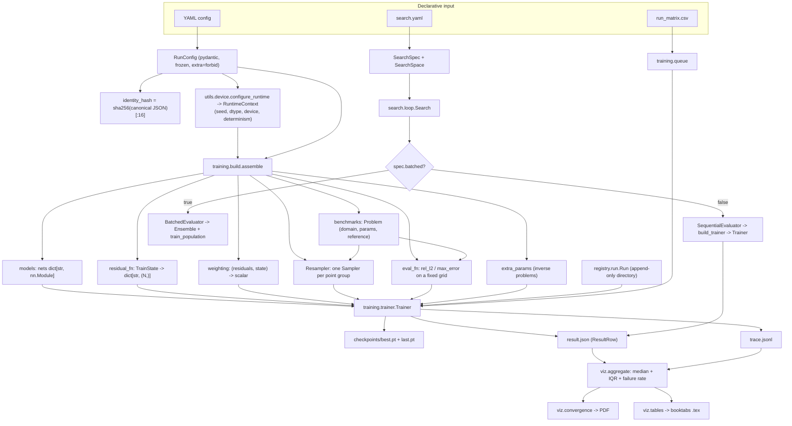
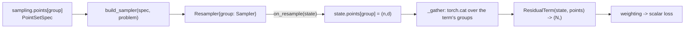
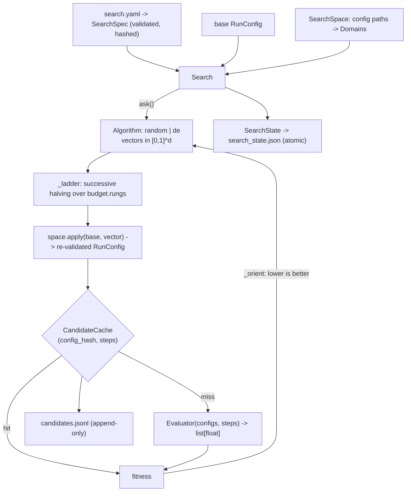

# PINNSLAB.md — the manual and architectural memory of pinnslab

**Canonical technical reference for this repository.** Read this first; open
source files only for the subsystem you are actually changing.

- **Version documented:** `pinnslab.__version__ == "0.3.0"` (`pinnslab/__init__.py:10`)
- **Documented against commit:** `1e47790` (branch `main`), 2026-08-29
- **Test suite at that commit:** 502 collected — 482 `unit and not slow`, 12 `slow`, 8 `golden`
- **Companion documents:** `DESIGN.md` (the *why*, living record), `CLAUDE.md`
  (binding session rules), `CHANGELOG.md` (what each tag changed),
  `FRICTION.md` (where the abstractions were wrong), `TESTS_TODO.md` (known test
  gaps), `LOG.md` (weekly research log), `examples/README.md` (worked experiment).

Anything marked **Unknown / requires verification** could not be established
from the code and must not be assumed.

---

## 0. Quick reference

| I want to…                                        | Do this                                                                                          |
| ------------------------------------------------- | ------------------------------------------------------------------------------------------------ |
| Understand what a run *is*                        | `RunConfig` in `pinnslab/registry/config.py`; a run = the pair `(config_hash, seed)`                |
| Define an experiment                              | Write a YAML config. **No number ever lives in a script** (CLAUDE.md rule 4)                       |
| Run one experiment                                | `python scripts/run.py cfg.yaml --results results/`                                               |
| Run one experiment from Python                    | `configure_runtime(cfg)` → `Run.create_or_resume(...)` → `build_trainer(cfg, ctx, run).fit()`      |
| Run many, on a machine that may die               | `python scripts/run_sweep.py run_matrix.csv --results results/`                                    |
| Resume an interrupted run                         | Re-issue the identical command. There is no resume flag                                            |
| Define a PDE / benchmark                          | `@register_problem` + `@register_residual` — see `pinnslab/benchmarks/burgers.py`                   |
| Add boundary / initial conditions                 | Extra `@register_residual` terms on `initial` / `boundary` point groups (soft), or a `TRANSFORMS` output transform (hard) |
| Use Adam                                          | `stages[].optimizers[] = {name: adam, lr: ...}`                                                    |
| Use L-BFGS                                        | A **separate stage** with `{name: lbfgs, lr: 1.0}` — never alongside another optimizer             |
| Do hybrid Adam→L-BFGS                             | Two `stages` entries, in order. This is the only "hybrid optimizer" mechanism that exists          |
| Use a metaheuristic                               | `scripts/run_search.py search.yaml --base cfg.yaml`. It optimises **config hyperparameters**, never network weights |
| Add a sampler                                     | One file, `@register_sampler("name")`, `--register` it. `examples/rad_sampler.py` is the template   |
| Add a loss weighting                              | `@register_weighting("name")`, object with `__call__(residuals, state) -> scalar`                    |
| Add an optimizer                                  | `@register_optimizer("name")`, factory `(params, OptimizerSpec) -> torch.optim.Optimizer`           |
| Add a network architecture                        | `@register_model("name")`, factory `(NetSpec) -> nn.Module`                                        |
| Add a metaheuristic algorithm                     | `@register_search("name")` on an `Algorithm` subclass (`ask`/`tell`/`state`/`load_state`)          |
| Turn results into figures and LaTeX               | `python scripts/make_figures.py results/ --out analysis/ --by method`                              |
| Compute median + IQR over seeds                   | `pinnslab.viz.aggregate.summarise` / `.band` — never mean ± std                                    |
| Check it works on a real GPU                      | `python scripts/validate_gpu.py --json report.json`                                                |
| Measure the batched-population speedup            | `python scripts/benchmark_population.py`                                                            |
| Debug divergence                                  | `results/<run_id>/result.json` → `status`, then `trace.jsonl`; see §22                              |
| Know what changed in a tag                        | `CHANGELOG.md`                                                                                     |
| Know why something is shaped this way             | `DESIGN.md`, and §19 of this file                                                                   |

---

## 1. What pinnslab is, and what it is not

**pinnslab is personal PINN *methods* research infrastructure.** It owns a
PyTorch training loop for physics-informed neural networks, plus everything
around that loop that makes a *result defensible*: validated hashed configs,
bit-exact resume, append-only provenance-stamped results, publication figures,
and a metaheuristic search layer over configuration space.

Its stated success metric is the author's papers-per-year (`CLAUDE.md`). It is
explicitly **not** a general-purpose PINN library, has **no API stability
promises**, and adding breadth (PDE zoos, tutorials, multi-backend support) is
documented as actively harmful (`DESIGN.md` §10).

### Why it exists rather than wrapping DeepXDE / Modulus

The research novelty lives *inside* the training loop — sampling, weighting,
optimizer schedule, architecture. Wrapping a framework whose loop is fixed would
mean monkey-patching for every paper. DeepXDE is therefore a **dependency, never
a foundation**: imported in exactly one file (`pinnslab/geometry/adapters.py`)
and used only as a geometry point generator. PhysicsNeMo/Modulus was ruled out
for wrong centre of gravity (large surrogates, multi-node clusters), heavy
container install, and API churn (`DESIGN.md` §1a).

Decisively: batching a whole population of PINNs into one graph — the capability
the entire research program rests on — is *structurally impossible* through
DeepXDE's stateful OO `Model`.

### The research program

Metaheuristic / population search over PINN configuration space, in four
directions that are **the same code with a different `RunConfig` field
selected**: sampling → loss weighting → optimizers → architecture. Paper 1
(sampling) is next; the infrastructure bootstrap (`DESIGN.md` §9 steps 1–5) is
complete.

### Two structural rules that shape everything

1. **DeepXDE is imported in exactly one file.** Enforced by
   `tests/unit/test_geometry.py::test_deepxde_is_imported_in_exactly_one_file`,
   which regex-scans the package. No DeepXDE object escapes the adapter.
2. **Extension is by registration, not inheritance.** A new method is one new
   file with one `@register_*` decorator and **zero edits** to existing files.

---

## 2. Install, dependencies, environment

### Requirements (source of truth: `pyproject.toml`)

| Item | Value |
| --- | --- |
| Python | `>=3.11` (CI tests the floor, 3.11; author develops on 3.13) |
| Build backend | `hatchling` + custom hook `hatch_build.py` |
| Core deps | `torch>=2.2`, `deepxde>=1.12`, `numpy>=1.26`, `scipy>=1.11`, `pydantic>=2.7`, `pyyaml>=6.0` |
| `[analysis]` extra | `pandas>=2.2`, `pyarrow>=16.0`, `matplotlib>=3.8` |
| `[dev]` extra | `pytest>=8.0`, `ruff>=0.6`, plus `pinnslab[analysis]` |
| Lint | ruff, line-length 88, `select = ["E","F","I","UP","B","SIM"]` |

`scikit-optimize` (skopt) arrives as a **transitive dependency of deepxde** and
is what the `lhs` / `halton` / `hammersley` / `sobol` samplers need. pinnslab
does not declare it.

`pyproject.toml` states the `analysis` split is **not** an install-size saving:
importing `geometry/adapters` already pulls pandas, pyarrow and matplotlib in
via deepxde. The split exists so no `pinnslab` module may import analysis code.

### Install

```bash
git clone https://github.com/Ali-raza-5005/pinnslab
cd pinnslab
pip install -e ".[dev]"
pytest -m "unit and not slow"
```

A paper pins an exact tag, never a branch:

```bash
pip install "pinnslab @ git+https://github.com/Ali-raza-5005/pinnslab@v0.3.0"
```

### GPU / CUDA

- CPU is fully supported, and — as of this commit — is the **only** hardware
  this code has ever run on (§21).
- `device: auto` resolves to `cuda:0` when available, else `cpu`. `device: cuda`
  with no CUDA raises immediately rather than silently falling back.
- Determinism requires `CUBLAS_WORKSPACE_CONFIG=:4096:8`, set by
  `utils/seeding.set_seed` **before** the CUDA context exists. If CUDA is already
  initialised and the variable is wrong, `set_seed` **raises** rather than
  leaving reductions nondeterministic while logs claim otherwise.
- `torch.use_deterministic_algorithms(True)` *raises* rather than degrades for
  kernels with no deterministic implementation. Whether every kernel used here
  has one on CUDA is **unverified**; `scripts/validate_gpu.py` closes it.

### Environment variables

| Variable | Read by | Effect |
| --- | --- | --- |
| `PINNSLAB_LOG_LEVEL` | `utils/logging.py:26` | Level for the `pinnslab` logger root. Default `INFO` |
| `DDE_BACKEND` | `geometry/adapters.py:54` | `setdefault(..., "pytorch")` before importing deepxde. Any other backend is a hard `RuntimeError` |
| `CUBLAS_WORKSPACE_CONFIG` | `utils/seeding.py:53` | Set to `:4096:8` when `deterministic=True` |
| `CUDA_VISIBLE_DEVICES` | Operator, not library | The 2-GPU strategy: two independent sessions, one per GPU |
| `PINNSLAB_WORKER` / `PINNSLAB_WORKERS` | `notebooks/kaggle_runner.py` **only** | Queue worker partitioning in the notebook. Not read by the library |

### Import side-effect guarantees

- `import pinnslab` has **no** effect on global torch state — in particular it
  never calls `torch.set_default_dtype`.
- `import pinnslab.geometry.adapters` touches global state deliberately and
  undoes it: sets deepxde to float64, immediately restores torch's default dtype.
- `configure_runtime(cfg)` is the **only** place precision and seeding are
  applied. Call it once, at run start, **before any tensor is allocated**.
- `pinnslab.training.__init__` deliberately does **not** re-export `build` or
  `queue`, and `pinnslab.viz.__init__` re-exports nothing — both would drag
  deepxde/matplotlib into processes that do not want them. Import the module.

---

## 3. Directory map

```text
pinnslab/
├── pyproject.toml              packaging, deps, pytest markers, ruff config
├── hatch_build.py              build hook: stamps the commit into a wheel
├── CLAUDE.md                   binding standing rules for every session
├── DESIGN.md                   the "why" — living design record (~740 lines)
├── CHANGELOG.md  LOG.md  FRICTION.md  TESTS_TODO.md  README.md
├── PINNSLAB.md                 this file
├── .github/workflows/tests.yml CI: ruff + both test commands, Python 3.11, CPU
│
├── pinnslab/                   THE PACKAGE
│   ├── __init__.py             __version__ only; no side effects
│   ├── components.py           the @register_* registries (component registration)
│   ├── registry/               run PROVENANCE (a different sense of "registry")
│   │   ├── config.py           RunConfig + every *Spec; load_config / dump_config
│   │   ├── schema.py           Spec base, ResultRow, Provenance, TracePoint, MetricSchedule
│   │   ├── hashing.py          canonical JSON → sha256[:16] config hash
│   │   ├── provenance.py       git SHA resolution (3 routes), collect_provenance
│   │   └── run.py              Run object; the append-only run directory
│   ├── utils/
│   │   ├── device.py           configure_runtime, resolve_device, gpu_name, device_profile
│   │   ├── seeding.py          set_seed, derive_seed, make_generator, RNG capture/restore
│   │   ├── logging.py          one logging format, configured once per process
│   │   └── plugins.py          load_plugins — import a paper's @register_* module
│   ├── geometry/
│   │   ├── adapters.py         *** the ONLY deepxde import site *** Domain, interval, with_time
│   │   └── samplers.py         Sampler base, GeometrySampler, build_sampler
│   ├── models/mlp.py           MLP, activations, initialisers, build_net
│   ├── physics/diffops.py      gradient, partial, second_partial, laplacian, requires_grad
│   ├── losses/weighting.py     MeanWeighting (the only shipped reducer)
│   ├── benchmarks/
│   │   ├── problem.py          Problem dataclass, ResidualTerm/Factory types, resolve_params
│   │   └── burgers.py          burgers1d + Cole-Hopf exact solution + 3 residual terms
│   ├── eval/metrics.py         relative_l2, l2_error, max_error, uniform_grid
│   ├── training/
│   │   ├── trainer.py          *** THE TRAINING LOOP *** Trainer, TrainState
│   │   ├── build.py            config → Trainer (assemble, build_trainer, Resampler)
│   │   ├── checkpoint.py       CheckpointPayload, CheckpointManager, atomic save/load
│   │   ├── optimizers.py       adam + lbfgs factories, build_optimizer
│   │   └── queue.py            run_matrix.csv → resumable multi-cell sweep
│   ├── search/                 THE METAHEURISTIC LAYER
│   │   ├── space.py            Continuous/Integer/Categorical domains, SearchSpace
│   │   ├── spec.py             SearchSpec, FidelitySchedule, FitnessSpec, load_search_spec
│   │   ├── algorithms.py       Algorithm base, RandomSearch, DifferentialEvolution
│   │   ├── population.py       Ensemble (batched P MLPs), train_population
│   │   ├── evaluate.py         SequentialEvaluator, BatchedEvaluator, with_step_budget
│   │   ├── cache.py            CandidateCache — (config_hash, steps) → fitness
│   │   ├── state.py            SearchState, Evaluation, numpy RNG capture/restore
│   │   └── loop.py             Search — the driver (ask → ladder → tell → checkpoint)
│   └── viz/
│       ├── style.py            the one house style: palette, rcParams, save
│       ├── aggregate.py        results/ → median/IQR/failure rate; comparability guard
│       ├── convergence.py      the band (not line) convergence figure
│       └── tables.py           booktabs LaTeX tables from the same Summary objects
│
├── scripts/
│   ├── _bootstrap.py           puts the checkout on sys.path
│   ├── run.py                  one config, one seed
│   ├── run_sweep.py            a whole run_matrix.csv, resumably
│   ├── run_search.py           a metaheuristic search
│   ├── make_figures.py         results/ → figures + LaTeX tables
│   ├── validate_gpu.py         the GPU validation suite (never yet run on a GPU)
│   └── benchmark_population.py the batched-population speedup measurement
│
├── examples/                   a complete laptop-sized experiment (RAD vs uniform)
│   ├── configs/burgers_uniform.yaml   control arm
│   ├── configs/burgers_rad.yaml       treatment arm — differs in ONE field
│   ├── rad_sampler.py                 the method, outside the library, ~90 lines
│   ├── run_matrix.csv                 2 arms × 5 seeds
│   └── search.yaml                    a search over the method's two knobs
│
├── notebooks/kaggle_runner.py  the Kaggle notebook, kept as .py so it diffs
└── tests/
    ├── conftest.py             global-state isolation fixture + toy linear problem
    ├── unit/                   482 fast CPU tests (+12 of the total marked slow)
    ├── golden/                 8 tests: frozen Burgers config, end to end
    └── fixtures/               tiny configs, a queue worker, a frozen v1 result row
```

### Importance ratings

| Path | Purpose | Importance |
| --- | --- | --- |
| `pinnslab/training/trainer.py` | The loop we own; everything converges here | **Core — change with extreme care** |
| `pinnslab/registry/config.py` | The schema; also the metaheuristic's search space | **Core — any change re-hashes every config** |
| `pinnslab/registry/run.py` | Append-only run directory; CLAUDE.md rule 6 in code | **Core** |
| `pinnslab/training/checkpoint.py` | Bit-exact resume; format-versioned | **Core** |
| `pinnslab/geometry/adapters.py` | The single deepxde seam | **Core — structurally enforced** |
| `pinnslab/components.py` | Every extension point | **Core** |
| `pinnslab/search/*` | The research program's heart | **Core**, but `evaluate.py`'s batched path is *narrow* |
| `pinnslab/physics/diffops.py` | Rank-agnostic derivatives; one residual serves run *and* population | **Core** |
| `pinnslab/benchmarks/burgers.py` | The only benchmark; the golden test's subject | Core-adjacent |
| `pinnslab/models/mlp.py`, `losses/weighting.py` | Deliberately minimal *volatile* axes | Replaceable by registration |
| `pinnslab/viz/*` | Figures and tables; never imported by training | Optional at train time |
| `scripts/*`, `examples/*` | Entry points, worked examples, paper-repo template | Optional / copyable |

---

## 4. Architecture



### The seam structure

The `Trainer` knows about **stages, optimizers with a direction, checkpointing,
timing and provenance** — and *nothing at all* about PDEs, geometry,
architectures or sampling. Those enter through **three callables**:

```python
residual_fn(state) -> dict[str, Tensor]   # each of shape (N,), per-point
weighting(residuals, state) -> Tensor     # a 0-dim scalar; ALL reduction here
on_resample(state) -> None                # writes state.points; optional
```

plus an optional `eval_fn(state) -> dict[str, float]`.

There are therefore **two entry paths**:

1. **The config path** (`training/build.py`) — the supported way to start a real
   run. Builds every callable from a validated, hashed `RunConfig`, and
   **refuses to invent anything the config did not declare**. This is what keeps
   CLAUDE.md rule 4 ("no hyperparameter is ever a Python literal in a script")
   true in practice rather than in principle.
2. **The callable path** (`Trainer(...)` directly) — the documented escape
   hatch. A genuinely strange paper must be implementable without editing core.
   The infrastructure tests use this and drive the loop with no `physics/`,
   `geometry/` or `models/` in the picture at all.

### The two meanings of "registry" (do not confuse them)

| Module | Meaning | Contents |
| --- | --- | --- |
| `pinnslab/components.py` | **Component registration** | `@register_sampler`, `@register_residual`, … |
| `pinnslab/registry/` | **Run provenance** | `Run`, config hashing, `ResultRow` schema |

Both module docstrings call the collision out explicitly.

---

## 5. Data flow — one training step, end to end

```mermaid
sequenceDiagram
    participant L as Trainer._fit loop
    participant R as Resampler (on_resample)
    participant ST as TrainState
    participant F as residual_fn
    participant D as diffops (autograd)
    participant W as weighting
    participant O as optimizer group(s)
    participant RUN as Run (disk)

    L->>ST: publish step / stage_index / step_in_stage
    alt step_in_stage % resample_every == 0
        L->>R: on_resample(state)
        R->>ST: state.points = {group: (n, d) tensor}
    end
    L->>L: _zero_grads() over EVERY trainable, not only selected ones
    L->>F: residual_fn(state)
    F->>ST: read state.points; torch.cat the term's groups
    F->>D: requires_grad(points); net(x); gradient(...)
    D-->>F: derivatives, shape-preserving
    F-->>L: {name: (N,) tensor}   [validated by _check_residuals]
    L->>W: weighting(residuals, state)
    W-->>L: scalar loss           [ndim must be 0]
    L->>L: loss.backward()
    loop each optimizer group
        L->>O: negate grads if direction == "max"
        L->>O: clip_grad_norm_ if max_grad_norm is set
        L->>O: optimizer.step()
    end
    L->>L: non-finite loss? -> _diverged(), write the row, stop
    L->>L: target reached? -> record time_to_target_*
    alt trace schedule says record
        L->>RUN: log_metrics(step, {loss, residual/*, eval_fn metrics})
        L->>RUN: save_best if the best metric improved
    end
    alt checkpoint cadence due
        L->>RUN: save_last(payload incl. RNG + points + sampler state)
    end
```

For an **L-BFGS stage** the shape differs: the loop calls
`optimizer.step(closure)`, and the closure (zero-grad → forward → backward) may
run **several times per external step** because of the strong-Wolfe line search.
That is why `residual_fn` must be a deterministic function of `state` within one
step, and why points are read from `state.points` rather than drawn inline.

---

## 6. Core concepts, mapped to the implementation

| Concept | How pinnslab represents it | Where |
| --- | --- | --- |
| PDE problem | A **frozen** `Problem` dataclass: name, domain, physical params, reference solution, eval-grid resolution, `solution_net` | `benchmarks/problem.py` |
| Domain / geometry | `Domain` — frozen dataclass wrapping a deepxde geometry as a *point generator*. Public surface: `dim`, `time_dependent`, `lower`, `upper`, `bounds()`, `sample()` | `geometry/adapters.py` |
| Independent variables | Columns of the `(N, d)` collocation tensor. Time is **always the last coordinate** when `time_dependent` | `geometry/adapters.py:with_time` |
| Dependent variables | Network outputs `(N, m)`; index with `[..., i:i+1]` | `physics/diffops.py` |
| Neural network | `dict[str, nn.Module]` named in `RunConfig.nets`. Multi-net is first class | `models/mlp.py`, `training/build.py` |
| PDE residual | A `ResidualTerm`: `(state, points) -> (N,)`. **Per-point, never reduced** | `benchmarks/burgers.py` |
| Boundary condition | Soft: a residual term on the `boundary` group. Hard: a `TRANSFORMS` output transform via `NetSpec.output_transform` | §9 |
| Initial condition | Soft: a residual term on the `initial` group (`region: initial`, i.e. `t = t0`) | §9 |
| Collocation points | `TrainState.points: dict[group, (n, d) Tensor]` — **checkpointed** | `training/trainer.py` |
| Sampling | A `Sampler`: `(state, current) -> (n, d)`, one per declared point group | `geometry/samplers.py` |
| Loss function | A weighting object: `(dict[str, (N,)], state) -> scalar`. **All reduction lives here** | `losses/weighting.py` |
| Optimization | A **list** of `OptimizerSpec` per stage, each with a regex param selector and a `min`/`max` direction | `training/trainer.py` |
| Automatic differentiation | `torch.autograd.grad(create_graph=True)` via `physics/diffops.py`. Rank-agnostic (`...` indexing) so one residual serves `(N,m)` and `(P,N,m)` | `physics/diffops.py` |
| Metaheuristic optimization | Search over **config hyperparameters**, encoded in the unit cube `[0,1]^d`. Never over network weights | `search/` |
| Hybrid optimization | Multi-**stage** training (Adam → L-BFGS). There is **no** metaheuristic→gradient warm-start mechanism | §12 |
| Model evaluation | `eval_fn` computes `rel_l2` and `max_error` on a **fixed** tensor-product grid | `training/build.py:_make_eval_fn` |
| Reference solution | Computed, not shipped: Cole-Hopf via Gauss-Hermite quadrature for Burgers | `benchmarks/burgers.py` |
| Experiment configuration | YAML → pydantic `RunConfig` → `identity_hash()`. The schema **is** the search space | `registry/config.py` |

---

## 7. Configuration

**Mechanism: YAML on disk → pydantic validation on load → hash the validated
object.** No Hydra, deliberately and permanently (`DESIGN.md` §9): the `search/`
layer already does what Hydra's sweeper does and would fight it, and a pydantic
model *is* a schema whose typed field bounds double as the metaheuristic's
search space.

### Entry points

```python
from pinnslab.registry.config import load_config, dump_config, RunConfig

cfg = load_config("configs/burgers.yaml")   # the ONLY supported loader
cfg.identity_hash()                          # '0ebf401fda6fa1d0' — 16 hex chars
cfg.total_steps                              # sum over stages
cfg2 = cfg.model_copy(update={"seed": 3})    # configs are frozen; copy to change
dump_config(cfg, "out.yaml")
```

### Base model behaviour (`registry/schema.py:Spec`)

Every config model inherits `Spec`, which is `ConfigDict(extra="forbid",
frozen=True)`. A typo'd YAML key is a **load-time error**, not a silently
ignored hyperparameter. `ResultRow` is the single deliberate exception — it uses
`extra="ignore"` so old code can read rows written by newer code.

### `RunConfig` — full field reference

| Field | Type | Default | Notes |
| --- | --- | --- | --- |
| `name` | `str` | `"run"` | Cosmetic. **Not hashed** |
| `tags` | `dict[str, str]` | `{}` | Free-text labels; land on every result row; **not hashed**. This is what `--by method` groups on |
| `seed` | `int >= 0` | `0` | **Not hashed** — five seeds of one condition must share a hash |
| `dtype` | `"float64" \| "float32"` | `"float64"` | **Hashed.** float32 and float64 results are not comparable |
| `device` | `str` | `"auto"` | `auto`/`cpu`/`cuda`/`cuda:1`. **Not hashed** |
| `deterministic` | `bool` | `True` | Drives `use_deterministic_algorithms`, cudnn flags, CUBLAS config |
| `problem` | `ProblemSpec \| None` | `None` | Required if `residuals` is non-empty |
| `nets` | `dict[str, NetSpec]` | `{}` | Named networks |
| `extra_params` | `dict[str, ParamSpec]` | `{}` | Inverse-problem unknowns |
| `residuals` | `dict[str, ResidualSpec]` | `{}` | Named loss terms |
| `weighting` | `WeightingSpec` | `kind="mean"` | How per-point residuals reduce to a scalar |
| `sampling` | `SamplingSpec` | `points={}` | Named collocation groups |
| `stages` | `list[StageSpec]` | **required, min 1** | Sequential training blocks |
| `eval` | `EvalSpec` | defaults | Best-metric tracking, target, divergence policy |
| `logging` | `LoggingSpec` | defaults | Trace density. **Not hashed** |
| `checkpoint` | `CheckpointSpec` | defaults | Checkpoint cadence. **Not hashed** |

`HASH_EXCLUDE = {"name", "tags", "seed", "device", "logging", "checkpoint"}`.

### Nested specs

**`ProblemSpec`** — `name: str` (required), `options: dict[str, Scalar] = {}`.
Options are the physical constants the benchmark declares varyable; an unknown
one is rejected by `resolve_params` naming the ones that exist.

**`NetSpec`** — `arch="mlp"`, `inputs: int > 0` (required), `outputs=1`,
`width=32`, `depth=4` (hidden layers), `activation="tanh"`,
`init="glorot_normal"`, `output_transform: str|None = None`, `options={}`.
Typed fields are exactly the ones architecture search will search over;
arch-specific knobs (Fourier scale, SIREN `omega_0`) go in `options` and are
forwarded verbatim to the registered factory.

**`ParamSpec`** — `init: float` (required), `shape: tuple[int,...] = ()`,
`trainable=True`. Reaches optimizers through the `extra.<key>` selector
namespace, so inverse problems need no special casing anywhere.

**`ResidualSpec`** — `kind: str` (required, a `RESIDUALS` key),
`points: tuple[str,...] = ("interior",)` (a bare string is accepted),
`net="u"`, `options={}`.
> **Read this before writing a PDE config.** `points` takes a *list* because a
> PDE residual generally holds on the **closed** domain. On 1-D Burgers, moving
> `pde` from `interior` to `[interior, initial, boundary]` improves rel-L2 by
> roughly **6×** (0.127 → 0.020 at 15k Adam) while *lowering* the loss less —
> interior-only is simply an easier objective whose minimiser is not the true
> solution. Stock DeepXDE does this implicitly (`train_x_all`); here it is
> declared, hashed and visible in the results row.

**`WeightingSpec`** — `kind="mean"`, `coefficients: dict[str, float] = {}`
(per-term scalars every scheme understands), `options={}` (scheme-specific).
A coefficient naming a non-residual is a load error.

**`PointSetSpec`** — `region: "interior"|"boundary"|"initial" = "interior"`,
`n: int > 0` (required), `strategy="pseudo"` (a `SAMPLERS` key), `options={}`.

**`SamplingSpec`** — `points: dict[str, PointSetSpec] = {}`. Resampling *cadence*
lives on the stage, not here.

**`OptimizerSpec`** — `name="adam"`, `lr: float > 0 = 1e-3`, `params=".*"`
(full-match regex over `"<net>.<param>"` and `"extra.<key>"`),
`direction: "min"|"max" = "min"`, `max_grad_norm: float|None = None`,
`options={}` (forwarded verbatim to the factory).

**`StageSpec`** — `name: str` (required, unique across stages),
`optimizers: list[OptimizerSpec]` (min 1), `steps: int > 0`,
`resample_every: int|None = None`.

**`EvalSpec`** — `best_metric: str|None = None`, `best_mode="min"`,
`target_metric: str|None = None`, `target_value: float|None = None`,
`target_mode="min"`, `stop_on_nonfinite=True`.
`target_metric` and `target_value` must be set together.
`target_mode` is **separate from `best_mode` on purpose** — borrowing it made a
config that maximised one metric while targeting another record time-to-target
as reached at the first trace point (fixed in v0.3.0).

**`LoggingSpec`** — `trace: MetricSchedule`.
**`MetricSchedule`** — `every: int|None = 100`, `n_per_decade: int|None = None`,
`record_first=True`, `record_last=True`. Stateless by design, so a resumed run
records the same steps an uninterrupted one would. An all-off schedule is a
validation error.

**`CheckpointSpec`** — `every_seconds: float|None = 600.0`,
`every_steps: int|None = None`, `save_best=True`, `save_last=True`.

### Cross-field validation (fires only once `residuals` is non-empty)

`RunConfig._volatile_axes_are_consistent` rejects, at load time:

- residuals declared but `nets` empty;
- a residual naming no point group;
- a residual naming a point group `sampling.points` does not declare;
- a residual naming a network `nets` does not declare;
- `weighting.coefficients` naming a term that is not a residual;
- (separately) duplicate stage names.

Each of these would otherwise surface hours into a Kaggle session.

### Config hashing (`registry/hashing.py`)

Recipe: pydantic → JSON-native dict → canonical JSON (sorted keys, no
whitespace, `allow_nan=False`) → sha256 → first 16 hex chars. Stable across
processes, machines and Python versions — `hash()` and `pickle` are both
unusable for this. The hash is the join key between a result row, a checkpoint,
a search-cache entry and a figure.

**Consequence to internalise:** adding *any* field to `RunConfig` (even with a
default) changes **every** config hash, therefore every run id, therefore — via
`derive_seed(seed, "trainer", config_hash)` — every collocation cloud. v0.3.0
did exactly this and moved the example's rel-L2 numbers without changing any
physics (`examples/README.md` documents the effect).

### Example: a complete config

`examples/configs/burgers_uniform.yaml` is the canonical worked example. The
smallest useful skeleton:

```yaml
name: burgers-uniform
tags: {method: uniform}
seed: 0
dtype: float64
device: auto
deterministic: true

problem:
  name: burgers1d
  options: {nu: 0.03183098861837907}   # 0.1/pi

nets:
  u: {arch: mlp, inputs: 2, outputs: 1, width: 20, depth: 4,
      activation: tanh, init: glorot_normal}

residuals:
  pde: {kind: burgers1d.pde, points: [interior, initial, boundary]}
  ic:  {kind: burgers1d.ic,  points: initial}
  bc:  {kind: burgers1d.bc,  points: boundary}

sampling:
  points:
    interior: {region: interior, n: 1000, strategy: pseudo}
    initial:  {region: initial,  n: 100}
    boundary: {region: boundary, n: 50}

weighting: {kind: mean}

stages:
  - name: adam
    steps: 1500
    resample_every: 250
    optimizers: [{name: adam, lr: 0.001}]
  - name: lbfgs           # L-BFGS gets its own stage, on a fixed cloud
    steps: 100
    optimizers: [{name: lbfgs, lr: 1.0}]

eval:
  best_metric: rel_l2
  best_mode: min
  target_metric: rel_l2
  target_value: 0.01

logging:  {trace: {every: 100, record_first: true, record_last: true}}
checkpoint: {every_seconds: null, every_steps: 500, save_best: true, save_last: true}
```

### Command-line configuration

Scripts take **no hyperparameters of their own**. The only exceptions are
operational: `--results`, `--out`, `--root`, `--worker/--workers`, `--deadline`,
`--register`, and `--seed` on `scripts/run.py` (legal because seed is already
excluded from the hash, so overriding it still names the same condition).

---

## 8. Problem definition — how you describe a PDE

### The `Problem` object (`benchmarks/problem.py`)

Benchmarks are **frozen**: the PDE, its domain, its BC/IC forms and its
reference solution are fixed so every paper compares against the same problem.

```python
@dataclass(frozen=True)
class Problem:
    name: str
    domain: Domain
    params: Mapping[str, float] = {}        # physical constants, resolved
    reference: Callable[[Tensor], Tensor] | None = None   # (N,d) -> (N,1)
    eval_resolution: tuple[int, ...] = ()   # per coordinate
    solution_net: str = "u"                 # which net the reference describes
```

`reference_at(points)` raises a clear error when there is no reference.
`resolve_params(spec, defaults, name=...)` merges `ProblemSpec.options` over the
benchmark's defaults and **rejects unknown constants** — a typo'd `mu` where
`nu` was meant would otherwise leave the run solving the default equation while
the recorded config claims otherwise.

### Type contracts

```python
ResidualTerm    = Callable[[TrainState, Tensor], Tensor]   # -> (N,)
ResidualFactory = Callable[[ResidualSpec, Problem], ResidualTerm]
```

The factory takes the `Problem` so physical constants have exactly one home. A
residual reading `nu` from its own options could disagree with the reference
solution, and the run would look perfectly healthy while solving a different
equation than it reports.

### Geometry (`geometry/adapters.py`)

```python
from pinnslab.geometry import interval, with_time
domain = with_time(interval(-1.0, 1.0), 0.0, 1.0)   # x in [-1,1], t in [0,1]
```

Only these two constructors ship. `Domain.sample(region, n, *, generator,
strategy, dtype, device) -> (n, dim)`:

- `region`: `"interior"` (full space-time volume), `"boundary"` (spatial
  boundary at random times), `"initial"` (`t = t0`; requires `time_dependent`).
- `generator`: the `torch.Generator` to drive sampling from. Omitting it makes
  the run irreproducible and is never right in training code.
- Returns a raw `torch.Tensor`. A deepxde object never escapes.
- If deepxde returns fewer points than asked for (it does, quietly, for some CSG
  cases) this **raises**: point counts are part of the experimental condition
  and must not drift silently.

Three deepxde behaviours this module exists to neutralise, all documented in its
docstring: the ambient backend choice, deepxde's use of numpy's *global* RNG for
sampling (wrapped by `_numpy_stream`, which seeds numpy from the explicit torch
generator and restores global state afterwards), and
`dde.config.set_default_float` mutating `torch.set_default_dtype` as a side
effect.

### The shipped benchmark: `burgers1d`

$$u_t + u\,u_x = \nu\,u_{xx},\qquad x\in[-1,1],\ t\in[0,1]$$

with $u(x,0) = -\sin(\pi x)$, $u(\pm 1, t) = 0$, default
$\nu = 0.01/\pi$ (`DEFAULT_NU`).

| Registered name | Kind | Returns |
| --- | --- | --- |
| `burgers1d` | problem | the `Problem` |
| `burgers1d.pde` | residual | `(u_t + u·u_x − ν·u_xx).squeeze(-1)` |
| `burgers1d.ic` | residual | `(u(x,t) + sin(πx)).squeeze(-1)` — enforced on the `initial` group |
| `burgers1d.bc` | residual | `u(x,t).squeeze(-1)` — homogeneous Dirichlet |

Boundary and initial conditions are **soft** (residual terms), deliberately, so
the benchmark matches the DeepXDE oracle it is compared against.

**The reference solution is computed, not shipped.** Cole-Hopf
($u = -2\nu\,\phi_x/\phi$) turns Burgers into the heat equation:

$$u(x,t) = -\frac{\int \sin(\pi(x-\eta))\,f(x-\eta)\,e^{-\eta^2/(4\nu t)}\,d\eta}
{\int f(x-\eta)\,e^{-\eta^2/(4\nu t)}\,d\eta},\qquad f(y)=e^{-\cos(\pi y)/(2\pi\nu)}$$

Three implementation notes, each of which produces silent garbage if skipped:
**Gauss-Hermite quadrature** (the substitution $\eta=\sqrt{4\nu t}\,z$ makes the
Gaussian factor the Hermite weight exactly; adaptive quadrature misses the peak
at small $t$); **nodes from scipy, not numpy** (`numpy.polynomial.hermite.
hermgauss` overflows to `nan` past ~100 nodes); **log-sum-exp always** ($f$
spans $e^{\pm 50}$). `QUADRATURE_NODES = 400`, `EVAL_RESOLUTION = (256, 100)`,
`CHUNK_SIZE = 4096`. Evaluated in float64 regardless of the ambient dtype.

Validated in `tests/unit/test_burgers.py` against an **independent
finite-difference solve** (agreement to rel-L2 1.3e-4). That independence is the
point: convergence tests only catch a wrong *evaluation* of a formula, not a
wrong formula.

### Adding a new PDE — the recipe

One new file in a paper repo's `src/method/` (or `benchmarks/` once a second
paper needs it):

```python
import torch
from pinnslab.benchmarks.problem import Problem, ResidualTerm, resolve_params
from pinnslab.components import register_problem, register_residual
from pinnslab.geometry import interval, with_time
from pinnslab.physics.diffops import gradient, requires_grad
from pinnslab.registry.config import ProblemSpec, ResidualSpec

NAME = "heat1d"
DEFAULTS = {"alpha": 0.1}

@register_problem(NAME)
def build_heat(spec: ProblemSpec) -> Problem:
    params = resolve_params(spec, DEFAULTS, name=NAME)
    return Problem(
        name=NAME,
        domain=with_time(interval(0.0, 1.0), 0.0, 1.0),
        params=params,
        reference=lambda pts: my_exact(pts, **params),   # or None
        eval_resolution=(128, 100),
        solution_net="u",
    )

@register_residual(f"{NAME}.pde")
def make_pde(spec: ResidualSpec, problem: Problem) -> ResidualTerm:
    alpha = problem.params["alpha"]          # constants come from the PROBLEM
    net_name = spec.net
    def pde(state, points: torch.Tensor) -> torch.Tensor:
        x = requires_grad(points)            # BEFORE the forward pass
        u = state.nets[net_name](x)
        du = gradient(u, x)                  # (N, d): one backward pass
        u_x, u_t = du[..., 0:1], du[..., 1:2]
        u_xx = gradient(u_x, x)[..., 0:1]
        return (u_t - alpha * u_xx).squeeze(-1)   # (N,) — NEVER a scalar
    return pde
```

Common mistakes, all of which the code catches or the docs warn about:

- Returning a scalar or an `(N,1)` column → `_check_residuals` raises.
- Flagging `requires_grad` *after* the forward pass → the graph is gone;
  `gradient` raises "inputs do not require grad".
- Reading a physical constant from `spec.options` instead of `problem.params`
  → the residual and the reference can silently disagree.
- Using `[:, i:i+1]` instead of `[..., i:i+1]` → works for a single run, breaks
  for the batched population.
- Enforcing the PDE on `interior` alone → see the 6× warning in §7.

---

## 9. Boundary and initial conditions

Two mechanisms exist, and only the first is used by anything shipped.

### Soft constraints (implemented, used everywhere)

A BC/IC is an ordinary named residual term evaluated on a point group drawn from
the relevant region:

```yaml
sampling:
  points:
    initial:  {region: initial,  n: 100}
    boundary: {region: boundary, n: 50}
residuals:
  ic: {kind: burgers1d.ic, points: initial}
  bc: {kind: burgers1d.bc, points: boundary}
weighting:
  kind: mean
  coefficients: {ic: 10.0, bc: 10.0}    # optional per-term reweighting
```

`region: initial` requires a time-dependent domain; on a non-time domain
`Domain.sample` raises.

### Hard constraints (the seam exists; **the registry is empty**)

`NetSpec.output_transform` names a key in the `TRANSFORMS` registry. `MLP.forward`
applies it as `y = output_transform(x, y)` — it receives the *inputs* as well as
the prediction, because it has to know which boundary it is enforcing.

```python
OutputTransform = Callable[[Tensor, Tensor], Tensor]   # (inputs, outputs) -> outputs
```

**`TRANSFORMS` ships deliberately empty** (`components.py:73-76`): a hard
constraint is problem-specific, so it is born in a paper repo and promoted only
if a second paper needs the same one. Note the lookup detail: `build_mlp` does
`TRANSFORMS.get(spec.output_transform)` and passes the result **directly** as the
transform — so you register the callable itself, **not a factory**:

```python
from pinnslab.components import register_transform

@register_transform("burgers_hard_ic")
def hard_ic(x, y):
    t = x[..., 1:2]
    return -torch.sin(math.pi * x[..., 0:1]) + t * y
```

Per-net rather than per-run, so a multi-net run carries one hard constraint per
field. **Untested territory:** nothing in the shipped test suite exercises a
registered transform end to end beyond the registry mechanics — verify yours
against a known solution before trusting it.

---

## 10. Neural networks

### What ships

Only `MLP` (`pinnslab/models/mlp.py`), registered as `mlp`. Modified-MLP,
Fourier features and SIREN are explicitly deferred to the paper that first needs
them (`DESIGN.md` §2 promotion rule).

`MLP(inputs, outputs, width, depth, activation, output_transform)` builds
`nn.Sequential` over dims `[inputs, width×depth, outputs]`, with the activation
between hidden layers and **none on the output layer**.

### Activations (`ACTIVATIONS` registry)

`tanh`, `sin` (a `Sin` module, since torch has none), `silu`, `gelu`,
`softplus`, `relu`.

> `relu` is registered **to be ruled out, not used**: its second derivative is
> identically zero, so any residual containing a Laplacian is exactly zero
> everywhere and the PDE term trains to a perfect, meaningless score.

### Initialisation (`_INITIALISERS` — a plain dict, deliberately not a registry)

`glorot_normal` (default), `glorot_uniform`, `he_normal`, `he_uniform`. Applied
to every `nn.Linear`, **biases zeroed**. Initialisation is explicit rather than
torch's `nn.Linear` default so that a from-scratch run and a DeepXDE oracle
start from the same distribution, and so a golden-test tolerance is not a
statement about a torch version.

`initialise()` draws from the **global** torch RNG, which `configure_runtime`
seeded from the config — two runs sharing a seed must start from identical
weights, and this happens before the trainer's dedicated stream exists.

### Precision and device

The builder **never picks a precision of its own.** Parameters are allocated in
the ambient default dtype/device that `configure_runtime` already set;
`training/build.py:_build_nets` then does `.to(device=ctx.device,
dtype=ctx.dtype)` explicitly.

### Multi-output and multi-network

- Multi-output: `NetSpec.outputs > 1`; residuals select a component with
  `component=` in `diffops.gradient` or by slicing `[..., i:i+1]`.
- Multi-network: any number of named entries in `nets`. A residual names the one
  it differentiates via `ResidualSpec.net`; a coupled-system residual reads
  further networks from `state.nets` directly, because naming them all in the
  spec would put the coupling structure in two places at once.
- `Problem.solution_net` names which network the reference solution describes,
  so a multi-net run is not silently scored against whichever net is called `u`.

### Custom architectures

```python
from pinnslab.components import register_model
from pinnslab.registry.config import NetSpec

@register_model("siren")
def build_siren(spec: NetSpec) -> nn.Module:
    omega = float(spec.options.get("omega_0", 30.0))
    ...
```

`build_net(spec)` dispatches through `MODELS`. Note `build_mlp` **raises** if
given any `options` — arch-specific knobs belong to the architecture that
understands them, and an unread option is a typo or a wrong `arch`.

**Constraint for batched search:** `search.population.Ensemble` batches only
modules whose `nn.Linear` layers have matching shapes and which use a single
activation throughout. Anything else must go through `SequentialEvaluator`.

---

## 11. Losses and weighting

### The contract

$$\mathcal{L} \;=\; \sum_k \lambda_k \cdot \operatorname{mean}\!\big(r_k^2\big)$$

where $r_k$ is term $k$'s **per-point** residual vector of shape `(N,)` and
$\lambda_k$ is `weighting.coefficients[k]` (default `1.0`).

That formula is exactly `MeanWeighting`, the only shipped reducer
(`losses/weighting.py`), registered as `mean`.

```python
@register_weighting("mean")
class MeanWeighting:
    def __init__(self, coefficients: dict[str, float] | None = None): ...
    def __call__(self, residuals: dict[str, Tensor], state) -> Tensor: ...
```

### Why reduction lives here and nowhere else

`DESIGN.md` §4 decision 1: **residual functions return per-point tensors of
shape `(N,)`, never scalars.** If residuals pre-reduce, per-point weighting
(causal, self-adaptive, RBA) becomes impossible without editing every residual.
This is enforced at runtime, not by convention — `Trainer._check_residuals`
raises on a wrong `ndim`, a non-tensor, or an empty dict, and `_forward` raises
if the weighting returns a non-scalar.

### How a weighting is constructed

`training/build.py:_build_weighting` calls
`WEIGHTINGS.get(kind)(coefficients=dict(spec.coefficients), **spec.options)`.
So **every** weighting must accept a `coefficients` keyword; anything
scheme-specific (causal tolerance, NTK update period) arrives from `options`.

### What is *not* implemented

NTK, GradNorm, self-adaptive, causal and min-max weighting are all named in
`DESIGN.md` §3 and **none of them exist**. They arrive with the paper that needs
them. Note that min-max/self-adaptive schemes need no new machinery in the
trainer: a second `OptimizerSpec` with `direction: max` over a disjoint
parameter slice is the mechanism (§12).

### Per-term metrics

The trainer records `residual/<name>` for every term as `mean(r**2)` at every
traced step, alongside the scalar `loss`. These are what you look at first when
one term is dominating.

---

## 12. Optimization

### What ships

| Name | Registered in | Type | Order | Gradients? | Factory options |
| --- | --- | --- | --- | --- | --- |
| `adam` | `training/optimizers.py` | `torch.optim.Adam` | First-order, stochastic-friendly | Required | `lr` + anything in `options`, forwarded verbatim |
| `lbfgs` | `training/optimizers.py` | `torch.optim.LBFGS` | Quasi-Newton, full-batch, closure-based | Required | Defaults `max_iter=20`, `line_search_fn="strong_wolfe"`, overridable via `options` |

`build_optimizer(params, spec)` dispatches through the `OPTIMIZERS` registry.

**L-BFGS defaults are load-bearing.** Without a line search, L-BFGS on PINN
losses stalls or diverges. `max_iter=20` is deliberately modest so one `.step()`
stays a meaningful unit of progress for the trace and the stage step count —
i.e. a "step" of an L-BFGS stage is up to 20 inner iterations.

### Stages: the sequencing mechanism

```yaml
stages:
  - {name: adam,  steps: 1500, optimizers: [{name: adam, lr: 1e-3}], resample_every: 250}
  - {name: lbfgs, steps: 100,  optimizers: [{name: lbfgs, lr: 1.0}]}
```

Stages run in order. Each builds its own optimizers fresh (there is no optimizer
state carried between stages). A checkpoint saved at a stage boundary is what a
resume snaps back to.

### Parameter selectors and directions

Each `OptimizerSpec` selects parameters by a **full-match regex** over the
namespace `"<net>.<param>"` and `"extra.<key>"`:

```python
trainer.named_parameters()
# {'u.net.0.weight': ..., 'u.net.0.bias': ..., 'extra.nu': ...}
```

Rules enforced by `Trainer._build_stage`:

- A selector matching **nothing** raises, listing what was available.
- Two optimizers in one stage claiming the **same** parameter raises — with
  per-optimizer directions that would be ambiguous, so selectors must be
  disjoint.
- L-BFGS paired with **any** other optimizer in one stage raises: it is
  closure-based and re-evaluates the loss internally, so a concurrent ascent
  step would see a different iterate than it stepped from.
- L-BFGS with `direction: "max"` raises.

`direction: "max"` is implemented by **negating that slice's gradients** after
`backward()` and before `step()`. That is the whole min-max / self-adaptive
mechanism — no special casing anywhere in the loop:

```yaml
stages:
  - name: adversarial
    steps: 2000
    optimizers:
      - {name: adam, lr: 1e-3, params: "u\\..*",       direction: min}
      - {name: adam, lr: 1e-2, params: "extra\\.lam.*", direction: max}
```

`max_grad_norm` clips **per optimizer group**, not globally.

### Update mechanics in the loop

- **First-order path** (`_step_first_order`): zero every trainable gradient →
  forward → `backward()` → per group: negate if ascending, clip if asked,
  `step()`. Returns the **pre-update** loss.
- **L-BFGS path** (`_step_lbfgs`): a closure that zero-grads, forwards,
  backwards and clips; `optimizer.step(closure)` returns the loss.

`_zero_grads` clears every trainable parameter's gradient, not only those an
optimizer owns — a parameter outside all selectors would otherwise accumulate
gradients forever.

### Hybrid optimization — what exists and what does not

| Pattern | Status |
| --- | --- |
| Adam → L-BFGS (staged) | **Implemented.** Two `stages` entries. This is the canonical hybrid |
| Simultaneous min / max optimizers | **Implemented.** Two `OptimizerSpec`s, disjoint selectors, opposite directions |
| Any number of sequential stages, each with its own optimizers and resampling cadence | **Implemented** |
| Metaheuristic → Adam warm start (population searches weights, then gradient refinement) | **Not implemented.** No code path takes an algorithm's output as an initialisation for a gradient run |
| Metaheuristic over **network weights** | **Not implemented, and out of scope by design.** The search layer optimises `RunConfig` fields |
| Metaheuristic → gradient hyperparameter refinement | **Partially, by hand.** A search returns a winning config; you then run it through `scripts/run.py`. Nothing automates the handoff |

Note also: `search.population.train_population` hard-codes
`torch.optim.Adam` — the batched path does not use the `OPTIMIZERS` registry at
all, and `BatchedEvaluator` refuses any config whose optimizer is not plain
`adam` (§15).

### Adding an optimizer

```python
from pinnslab.components import register_optimizer
from pinnslab.registry.config import OptimizerSpec

@register_optimizer("soap")
def build_soap(params, spec: OptimizerSpec) -> torch.optim.Optimizer:
    return SOAP(params, lr=spec.lr, **spec.options)
```

Zero edits to `training/optimizers.py`. Constraints: it must be a real
`torch.optim.Optimizer` (the trainer calls `state_dict()`/`load_state_dict()`
for resume, and `isinstance(..., LBFGS)` for the closure branch), and if it
carries state that does not round-trip through `state_dict`, resume stops being
bit-exact — silently.

---

## 13. Sampling

Sampling is the **first research direction** (`DESIGN.md` §6) and therefore the
most carefully built seam.

### The contract (`geometry/samplers.py`)

```python
# factory, registered:
(spec: PointSetSpec, problem: Problem) -> Sampler

# the sampler itself, called once per resample:
sampler(state: TrainState, current: Tensor | None) -> Tensor   # (n, dim)

# optional state, checkpointed for you:
sampler.state_dict() -> dict
sampler.load_state_dict(payload) -> None
```

`current` is the cloud this group is holding right now (`None` on the first
draw). The shape deliberately mirrors `ResidualTerm`'s `(state, points)` so
there is one convention to learn.

**Draw from `state.generator` and from nothing else.** A sampler reaching for
`torch.rand` or `np.random` puts the cloud outside the checkpoint and quietly
breaks bit-exact resume.

### Built-in samplers

All five are `GeometrySampler`, registered once per name so the registry *is*
the list of legal `strategy:` values:

| `strategy` | Algorithm | Notes |
| --- | --- | --- |
| `pseudo` | Uniform pseudorandom | The default and the baseline |
| `lhs` | Latin hypercube | via deepxde/skopt |
| `halton` | Halton sequence | **Deterministic** |
| `hammersley` | Hammersley sequence | **Deterministic** |
| `sobol` | Sobol sequence | **Deterministic** |

> **Trap worth naming.** `DETERMINISTIC_STRATEGIES = {halton, hammersley,
> sobol}` produce the *same points every time* for a given `n`, ignoring the
> RNG. Combining one with `resample_every` is a **silent no-op** that still
> costs the draw — and a sampling paper whose resampling does nothing still
> trains fine.

`GeometrySampler` **raises** if given any `options`: options are forwarded
verbatim to the registered factory, so an unread one is a typo or a wrong
sampler name.

### How points reach the loss



`training/build.py:Resampler` is an **object, not a closure**, for one reason: a
sampler may carry state, and the trainer checkpoints it through
`state_dict`/`load_state_dict`. Every sampler sees the cloud its group currently
holds, and the whole new cloud is installed **only once every group has drawn**
— so two adaptive groups in one config cannot see a half-updated state and
become order-dependent.

`build_trainer` fires `on_resample` **once at construction**, before training,
so the first residual evaluation finds a populated `state.points` even when no
stage sets `resample_every`.

### Resampling cadence and resume

`resample_every` is a property of a **stage**, not of a point set (warm up on
fixed points, then resample every K steps). The hook fires when
`step_in_stage % resample_every == 0`, *before* the step, with `state.step`
already published.

**The cloud is stored, not replayed** (`DESIGN.md` §7, resolved 2026-08-17).
Replay from the RNG works only while sampling is a pure function of that stream;
the moment a sampler reads the network — which is the whole of paper 1 — the
cloud in force at step *k* depends on a network that no longer exists after a
resume. So `CheckpointPayload` carries `points` and `sampler_state` (format
version 2). Pinned by `tests/unit/test_resampling.py`.

### Adaptive sampling: the worked example

`examples/rad_sampler.py` implements RAD (Wu, Zhu, Tan, Kartha & Lu, *CMAME*
2023) in ~90 lines, outside the library:

$$p(x) \;\propto\; \frac{\varepsilon(x)^k}{\mathbb{E}[\varepsilon^k]} + c$$

- Draws a uniform pool (default `10 × n`), scores it with a **registered
  residual built from the problem** (so the sampler cannot disagree with the
  loss about what the equation is), then `torch.multinomial` without
  replacement, using `state.generator`.
- Options: `k` (sharpening), `c` (uniform floor), `pool`, `residual`. `k=0` or
  large `c` reduces to uniform — which is what makes it a **one-knob mechanism
  ablation** against its own baseline.
- Generation 0 has no residual to score, so it is a plain uniform draw.
- Carries `state_dict` (a generation counter) so a resumed run continues the
  sampler's schedule.
- Uses `torch.enable_grad()` when scoring: the residual differentiates the
  network with respect to its *inputs*, so the graph is needed even though
  nothing is training. The result is detached immediately.

Measured on the shipped example (2026-08-28, CPU, float64, 5 seeds): RAD
rel-L2 median 7.46e-4 [5.52e-4, 7.70e-4] vs uniform 8.82e-4 [6.82e-4, 9.32e-4].
`examples/README.md` reads that honestly as **no difference**, and explains why
(smoothed viscosity → no sharp front → nothing for adaptivity to resolve), and
notes RAD is *behind* uniform at equal wall-clock because scoring a 10,000-point
pool every 250 steps is not free.

### Evaluation grids are not sampled

`eval/metrics.uniform_grid(domain, resolution, ...)` builds a fixed
tensor-product grid over the domain's **bounding box**. Metrics computed on
random points would move between runs, and comparing two methods would then be
comparing two point clouds as much as two solutions. Only valid for box
domains — on a non-convex or CSG geometry it returns points outside the domain
where the reference is undefined.

---

## 14. The training loop

`pinnslab/training/trainer.py` — 656 lines, the single most important file.

### `TrainState` — what a residual, weighting or hook may see

| Field | Meaning |
| --- | --- |
| `cfg` | The `RunConfig` |
| `nets` | `dict[str, nn.Module]` |
| `extra_params` | `dict[str, Tensor]` — inverse-problem unknowns |
| `generator` | The trainer's dedicated `torch.Generator`. **Draw from this** |
| `device`, `dtype` | From the `RuntimeContext` |
| `step`, `stage_index`, `stage_name`, `step_in_stage` | Position |
| `points` | `dict[group, (n,d)]` — **checkpointed** |
| `scratch` | Free-form hook space — **not checkpointed** |

The `points`/`scratch` split is deliberate and load-bearing: anything that must
survive a resume belongs in `points`, in `extra_params`, or in the resample
hook's own `state_dict`.

The generator is derived as `derive_seed(cfg.seed, "trainer", config_hash)` —
a dedicated stream so sampling reproducibility does not depend on how many
global draws happened first. **Consequence:** two different conditions never
share a sampling stream, so an A/B comparison here is *unpaired* and needs its
≥5 seeds.

### `Trainer.__init__` signature

```python
Trainer(
    *, cfg: RunConfig, ctx: RuntimeContext, nets: dict[str, nn.Module],
    residual_fn: ResidualFn, weighting: WeightingFn, run: Run,
    extra_params: dict[str, Tensor] | None = None,
    eval_fn: EvalFn | None = None,
    on_resample: HookFn | None = None,
    checkpoints: CheckpointManager | None = None,
    allow_config_change: bool = False,
)
```

`fit() -> ResultRow` trains to completion (or divergence) and writes exactly one
result row.

### `fit()` — the exact sequence

1. `_restore()` — load `last.pt` if present. Returns
   `(stage_index, steps_in_stage, step, loaded)`. **`loaded`, not `step == 0`,
   is the freshness signal**: a checkpoint saved at step 0 (the stage-boundary
   save) makes `step == 0` true on a genuine resume too.
2. If fresh and `trace.record_first`: `_record_baseline` — one forward pass at
   step 0, the **only** trace point where every metric shares one parameter
   vector. No `torch.no_grad()`: a PDE residual differentiates through the
   network to build itself.
3. For each stage from `start_stage`:
   - `_build_stage` → optimizer groups (validating selectors, disjointness,
     the L-BFGS rules).
   - If resuming mid-stage, `_restore_optimizers` (including L-BFGS curvature
     history); else `_save` a stage-boundary checkpoint.
   - Loop `steps` times:
     a. publish `state.step`/`step_in_stage` **before any hook runs**;
     b. fire `on_resample` if due;
     c. `_step` (timed; accumulated into `self._elapsed` and the stage's timing);
     d. non-finite loss + `stop_on_nonfinite` → `_diverged()` and return;
     e. cheap-target check (see below);
     f. trace-schedule check → `_record`;
     g. checkpoint-cadence check → `_save`.
   - Record `timings["stage.<name>.seconds"]`.
4. Final `_save`, `timings["train_seconds"]`, `run.finish(status=COMPLETED, …)`.

Any exception is routed through `_failed` (appending to `failures.jsonl`) and
**re-raised**. Recording a crash deliberately does **not** finish the run: a run
with a checkpoint behind it is still resumable, and a run may crash several
times before finishing.

### Metrics recorded at each traced step

```python
{"loss": <pre-update loss>,
 "residual/<name>": mean(r**2) for each term,
 **eval_fn(state)}        # rel_l2, max_error when a reference exists
```

### Time-to-target

Three timing keys when `eval.target_metric`/`target_value` are set:
`time_to_target_seconds`, `time_to_target_steps`,
`time_to_target_resolution_steps`.

The resolution matters. A target the step **already computed** (`loss` or
`residual/<name>`) is checked **every step**, resolution `1.0`. An `eval_fn`
metric (`rel_l2`) stays on the trace schedule, resolution `logging.trace.every`.
Reason: `logging` is excluded from the config hash, so two runs of one condition
may legitimately trace at different cadences — recording the observation
granularity is what stops an upper bound being read as an exact value.

### Best-checkpoint tracking

Driven by `eval.best_metric`/`best_mode`. `CheckpointManager.is_improvement`
refuses non-finite values in both directions: without that guard, a first NaN
would set `best` to NaN permanently (every later comparison against NaN is
`False`) and `best.pt` would hold whatever parameters blew up.

### Checkpointing (`training/checkpoint.py`)

`CheckpointPayload` carries: `step`, `stage_index`, `steps_in_stage`, `nets`
state dicts, `extra_params`, per-group `optimizers` state, full `rng` (python,
numpy, torch, CUDA, plus the trainer's own generator), `elapsed`, `config_hash`,
`seed`, `points`, `sampler_state`, best tracking, `timings`,
`pinnslab_version`, `format_version = 2`.

- **Atomic writes.** Write to a fixed `.tmp` next to the target, `os.replace`,
  then `fsync` the directory (POSIX only — Windows has no directory fd and needs
  no equivalent). `last.pt` is either the old checkpoint or the new one, never a
  corpse. An exception during the write unlinks the temp file.
- **`weights_only=True` on load.** The payload is built from tensors and plain
  Python containers precisely so this stays true — which is also why
  `capture_rng_state` converts numpy's state out of `ndarray`.
- **Format version mismatch raises.** A v1 checkpoint is refused rather than
  loaded with an empty cloud.
- **Resume verifies `(config_hash, seed)`** and refuses a mismatch unless
  `allow_config_change=True` (which warns loudly).
- **`best.pt` carries no optimizer state.** Nothing resumes from it — resume is
  `last.pt` by definition — and Adam's two moments per parameter were roughly
  two thirds of the file, written on every improvement.
- **L-BFGS resumes bit-exact.** `torch.optim.LBFGS` *does* carry `old_dirs`,
  `old_stps`, `ro`, `H_diag`, `prev_flat_grad`, `d`, `t` in `state_dict`. This
  was **measured, not assumed**, and is pinned by
  `test_lbfgs_resume_is_bit_exact` so a future torch moving that state out fails
  a test rather than silently producing a different experiment.

### Determinism and RNG (`utils/seeding.py`)

| Function | Purpose |
| --- | --- |
| `set_seed(seed, *, deterministic=True, warn_only=False)` | Seeds python/numpy/torch/CUDA; sets `CUBLAS_WORKSPACE_CONFIG`, `use_deterministic_algorithms`, cudnn flags |
| `derive_seed(base, *tags)` | blake2b-derived sub-seed, stable across processes and Python versions (`hash()` is not) |
| `make_generator(seed, device)` | An explicit RNG stream decoupled from the global one |
| `capture_rng_state()` / `restore_rng_state(state)` | Round-trip every stream through a checkpoint |

`restore_rng_state` **raises** when a checkpoint carries CUDA state but the
process has none, or when the device count differs — a comparison group must not
span hardware configurations, and silently continuing would change the
experiment invisibly.

Known quirk: `np.random.seed(seed % 2**32)`, so seeds differing by exactly
`2**32` collide in numpy but not in torch or python (queued in `TESTS_TODO.md`,
harmless in practice).

---

## 15. Results, provenance, and the run directory

### The run directory (`registry/run.py`)

```text
<results_root>/<run_id>/
├── config.yaml       the validated config, as loaded
├── config.json       the same, JSON, for machine reads
├── provenance.json   the FIRST session's provenance
├── sessions.jsonl    one line per session (create / resume)
├── failures.jsonl    one line per crash; a crash need not end the run
├── trace.jsonl       downsampled convergence trace, append-only
├── result.json       the ResultRow; written EXACTLY ONCE
└── checkpoints/      best.pt, last.pt
```

**CLAUDE.md rule 6 (`results/` is append-only) is enforced in code, not by
discipline**: `Run.create` refuses an existing directory, the trace is only ever
opened for append, and `result.json` is written with exclusive-create so a
second `finish()` raises instead of quietly rewriting history.

### Run identity

| Function | Produces | Used by |
| --- | --- | --- |
| `registry.run.make_run_id(cfg)` | `20260829T120215Z_ff8cf389_s0_ce39bc` — timestamped + uuid | `Run.create` when no id is passed |
| `training.queue.run_id_for(cfg, seed=None)` | `<config_hash[:12]>_s<seed>` — **deterministic** | The queue and `scripts/run.py`; this is the mechanism that makes resume work without remembering anything |

Because the queue's id *is* the identity, two matrix rows naming the same
`(config, seed)` collapse onto one run instead of training it twice, and a
changed YAML gets a new directory rather than corrupting the old one.

### `Run` API

| Method | Purpose |
| --- | --- |
| `Run.create(cfg, root, *, run_id=None)` | Fresh run; raises `FileExistsError` if the directory exists |
| `Run.resume(root, run_id, cfg)` | Reattach to an unfinished run; raises if `result.json` exists or the config hash differs; warns if the GPU changed |
| `Run.create_or_resume(cfg, root, run_id)` | The idempotent entry point queue-driven notebooks use |
| `run.log_metrics(step, metrics, *, stage, wall_time)` | Append one trace point |
| `run.log_failure(exc, *, step)` | Append a crash record. **Does not finish the run** |
| `run.finish(*, status, steps_completed, …) -> ResultRow` | Write `result.json` once |
| `run.read_trace()` / `read_trace(directory)` | Read the trace back |
| `load_runs(root, *, include_unfinished=False)` | Every row under a root |

> **`include_unfinished=True` whenever the number you are computing is a rate.**
> It synthesises a row per directory with no `result.json`: `status=failed` if it
> recorded a crash, `status=running` otherwise. A killed session gets no chance
> to write anything, so those runs are otherwise invisible — and a failure rate
> over only the runs that survived long enough to report one is not the failure
> rate. `viz.aggregate.load_records` defaults it to `True` for this reason.

`_read_jsonl` **skips** unparseable lines rather than stopping at the first one,
warning with a count. A session killed mid-write leaves a torn line, and the
next session appends straight onto that stump — fusing them into one bad line
with perfectly good records after it. Stopping there once reported a run that
trained to step 40 as having reached step 10.

### `ResultRow` — what every run records

```python
schema_version, run_id, config_hash, status,
pinnslab_version, git_sha, git_dirty, seed, gpu_name, dtype, device_profile,  # rule 7
timestamp_utc, steps_completed,
final_metrics, best_metrics, timings, tags, config, error
```

The provenance block is **required** on the model, so a row that omits it cannot
be constructed. `RunStatus` is `running | completed | diverged | failed`.

`ResultRow` uniquely uses `extra="ignore"` and carries `schema_version` (bump
only on a **rename, removal or meaning change**; adding a field with a default is
backward compatible). Rows are permanent, and a Kaggle session pinned to an
older tag reading rows written by a newer one is the ordinary case.

**Non-finite handling.** JSON has no `NaN`/`Infinity` (RFC 8259), but a diverged
run's final loss is exactly that. `json_safe` writes `"nan"`, `"inf"`, `"-inf"`
as strings on the way out and the `Metrics` annotated type converts them back on
the way in. Every registry writer passes payloads through it, and writes with
`allow_nan=False` so an escape fails loudly.

**Divergence is data, not an error.** A non-finite loss with
`stop_on_nonfinite=True` ends the run with `status=diverged`, a reason string, a
final trace point, and a full result row — because failure rate is a reported
metric.

### Timing keys (first-class results, not metadata)

| Key | Meaning |
| --- | --- |
| `train_seconds` | Total in-loop training wall clock |
| `stage.<name>.seconds` | Per-stage wall clock |
| `time_to_target_seconds` | Seconds to first reach `eval.target_value` |
| `time_to_target_steps` | Steps to the same |
| `time_to_target_resolution_steps` | Observation granularity (1.0, or `trace.every`) |

### Provenance and the git SHA (`registry/provenance.py`)

Three resolution routes, tried **in this order**:

1. **`git`** — a working tree. Asks `git rev-parse HEAD`, records `dirty`
   (untracked files count: code not in the commit is exactly what makes the SHA
   an incomplete description). Guards against picking up an unrelated enclosing
   repository.
2. **`direct_url`** — PEP 610 `direct_url.json`, i.e. `pip install git+…@tag`.
   The Kaggle online path. An installed artifact cannot be dirty.
3. **`build_stamp`** — `hatch_build.py` wrote `pinnslab/_build_info.py` into the
   wheel. The Kaggle **offline** path (`pip install --no-index`). Carries the
   build's dirty flag through honestly.
4. Otherwise `("unknown", False, "unknown")` — **a row that cannot name its
   code. Treat that as a result you cannot publish.**

Order matters: working tree first, stamp last, so a developer is never told what
some earlier build thought.

> **Documentation discrepancy (verified 2026-08-29).** `README.md` says "The
> row's `git_source` field says which route answered." `git_source` is a field of
> **`Provenance`** (written to `provenance.json` and each `sessions.jsonl` line),
> **not** of `ResultRow` (`result.json`). Confirmed:
> `'git_source' in ResultRow.model_fields` → `False`. Read it from
> `provenance.json`.

`collect_provenance` also records hostname, python version, torch version and
platform.

---

## 16. Sweeps: the run queue

`pinnslab/training/queue.py` — many cells across dying sessions.

### The input

`run_matrix.csv`, an **immutable declarative input**:

```csv
config,seed,notes
configs/burgers_uniform.yaml,0,control arm
configs/burgers_rad.yaml,4,treatment arm
```

Required columns: `config`, `seed`. `notes` is optional and ignored. Config
paths resolve **relative to the CSV**, so a matrix and its configs move between
machines as one directory. `config_for(cell)` applies the matrix's seed over
whatever the YAML says — seeding is the axis the matrix exists to sweep.

> **Only `seed` may live in the matrix**, never a hyperparameter. Seed is
> already excluded from the config hash, so it is the one field that can sit
> outside a config without breaking rule 4. Arbitrary overrides in the CSV would
> reintroduce exactly the number-in-a-script problem, and those numbers would not
> be hashed.

### Status is derived, never written

`CellStatus` is computed from the filesystem every time:

| Status | Condition |
| --- | --- |
| `pending` | No run directory |
| `resumable` | Directory exists, no `result.json` — what a killed session leaves |
| `failed` | Same, plus at least one record in `failures.jsonl` |
| `done` | `result.json` exists. Immutable; never claimed again |

Three consequences, spelled out in the module docstring: rule 6 holds by
construction; a killed session leaves no lie (a status column written before the
work strands rows in `claimed` forever, written after it loses every interrupted
run); and two GPUs never contend.

### Worker partitioning

`select(cells, root, *, worker, workers)` takes rows where `index % workers ==
worker`. Static partitioning is what makes claiming **lock-free** — no two
workers ever consider one cell, so a stale claim cannot exist and no lease or
heartbeat is needed. Within a worker's slice, **unfinished cells come before
untouched ones**: only started work has compute at risk.

### API

| Function | Purpose |
| --- | --- |
| `load_matrix(path) -> list[Cell]` | Parse and validate the CSV |
| `config_for(cell) -> RunConfig` | Load + apply the matrix seed |
| `run_id_for(cfg, seed=None) -> str` | The deterministic id |
| `status_of(root, run_id) -> CellStatus` | Read status off the filesystem |
| `select(...) -> list[Cell]` | This worker's outstanding cells, most urgent first |
| `run_cell(cell, root) -> ResultRow` | Train one cell, starting or resuming as required |
| `run_queue(cells, root, *, worker, workers, deadline_seconds) -> QueueReport` | Work through them |
| `statuses(cells, root)` | The whole matrix's derived status |

`run_queue` behaviours worth knowing:

- **Every config is loaded and validated before the first cell trains.** A typo
  that surfaces two hours into a session has cost two hours.
- **A cell that raises is logged and the queue moves on.** `Trainer.fit` already
  wrote the crash; one bad configuration must not take the sweep down.
- **`deadline_seconds` stops *claiming new* cells** once the time left is less
  than the longest cell seen this session. It never interrupts a running one —
  checkpoint/resume already handles a hard kill exactly. The first cell is
  always claimed (with nothing measured yet there is no basis for declining).

`run_cell` wraps **only** the assembly step in a try/except that logs a failure:
a config that cannot be built (unregistered problem, bad selector, OOM
allocating nets) would otherwise leave a directory indistinguishable from a
killed session. `Trainer.fit` logs its own crashes, and logging twice would
report one failure as two.

### Kaggle operation (`notebooks/kaggle_runner.py`)

The notebook is ~4 cells: install from a **tag**, copy the previous sessions'
Dataset into `/kaggle/working`, `run_queue(...)`, publish back.

The one operational subtlety that matters: **`root` must survive the session.**
`/kaggle/working` is wiped between sessions; `/kaggle/input` is read-only. So the
session copies out of the mounted Dataset, runs in the working directory, and
publishes back as a new Dataset version.

Two GPUs: **do not use DDP** (PINN nets are tiny; all-reduce costs more than it
saves). Run the notebook twice with different `CUDA_VISIBLE_DEVICES` and
`PINNSLAB_WORKER`, **separate `root` directories**, and keep
`CUDA_VISIBLE_DEVICES` the same for a given worker across sessions — the
checkpoint stores one CUDA RNG state per visible device and `restore_rng_state`
refuses a device-count change.

**Never edit pinnslab on Kaggle.** Edit locally → push → tag → install the tag.
A session that pip-installs from a branch cannot say what it ran.

---

## 17. The metaheuristic search layer

`pinnslab/search/` — the research program's heart. **It searches over
`RunConfig` fields, never over network weights.**



### The search space (`search/space.py`)

A space names **config paths** and maps each to a domain. Everything is encoded
as a point in the **unit cube `[0,1]^d`** — the one representation DE, CMA-ES,
PSO and random search all share, so the algorithm layer never learns what a
"width" or a "collocation count" is.

| Domain | Fields | `decode` behaviour |
| --- | --- | --- |
| `Continuous` | `low`, `high`, `log=False` | Linear or log-spaced interpolation. `log=True` needs `low > 0` |
| `Integer` | `low`, `high`, `log=False` | `+1`-then-floor so every integer gets an equal slice of `[0,1]` |
| `Categorical` | `choices` (≥2, distinct) | Index by `floor(unit × len)`. **Order is part of the space's identity** — a metaheuristic treats the axis as continuous, so neighbouring indices are neighbouring proposals |

`_clip_unit` clamps to `[0,1]`: proposals outside the box are the *normal* case
(DE mutation and CMA-ES sampling both routinely overshoot), so this is the box
constraint, not an error path.

`Integer.encode` returns the **midpoint** of the value's slice, not its left
edge — encoding the edge round-trips wrong, because `decode` floors and a
floating-point hair low lands on `value - 1` (measured: `encode(45)` decoded to
44).

`SearchSpace`:

- Ordered — the vector's axes are positional and checkpoints store vectors, so
  reordering would silently reinterpret every stored population.
- `apply(base, vector)` decodes into `base.to_dict()` and **re-validates through
  pydantic**. A search therefore cannot propose a configuration a human could not
  have written by hand, and every candidate has an `identity_hash`.
- `validate_against(base)` fails **before the first candidate trains** if a path
  does not exist. A typo'd path in a search that silently optimises nothing is
  the worst possible failure — it produces a full set of plausible results.

```yaml
space:
  sampling.points.interior.n: {kind: integer, low: 500, high: 8000}
  stages.0.optimizers.0.lr:   {kind: continuous, low: 1e-5, high: 1e-2, log: true}
  nets.u.activation:          {kind: categorical, choices: [tanh, sin, silu]}
```

List indices are supported (`stages.0...`) — `_resolve` walks integers into
lists.

### `SearchSpec` (`search/spec.py`)

| Field | Default | Meaning |
| --- | --- | --- |
| `name` | `"search"` | Cosmetic; excluded from the spec hash |
| `seed` | `0` | Excluded from the spec hash (several seeds of one search are one condition) |
| `space` | **required, ≥1** | config path → domain mapping |
| `algorithm` | `"random"` | A `SEARCH_ALGORITHMS` key |
| `algorithm_options` | `{}` | Forwarded to the algorithm's constructor |
| `pop_size` | `16` (`>1`) | Population per generation |
| `generations` | `10` (`>0`) | Outer iterations |
| `budget` | `FidelitySchedule(rungs=(1000,), keep=0.5)` | Successive halving |
| `fitness` | `FitnessSpec(metric="rel_l2", direction="min", penalty=None)` | The objective |
| `batched` | `True` | Which evaluator `scripts/run_search.py` builds |

`total_inner_steps = generations × budget.cost(pop_size)` — the **declared
bound**, printed by the script next to the measured `SearchState.
total_inner_steps`.

**`FidelitySchedule.cost` charges a survivor the full rung, not the increment**,
because both evaluators **retrain a promoted candidate from scratch**. Charging
the increment under-reported the budget by 21% on
`rungs=(1000,5000,20000), keep=0.5, pop=16` (108,000 vs the 136,000 actually
spent) — understating exactly the number a compute-parity defence rests on.
Fixed in v0.3.0.

### Algorithms (`search/algorithms.py`)

```python
class Algorithm:
    def __init__(self, dim, pop_size, rng: np.random.Generator, **options)
    def ask(self) -> np.ndarray             # (pop_size, dim) proposals
    def tell(self, candidates, fitness)     # fitness already oriented: LOWER IS BETTER
    def state(self) -> dict                 # everything EXCEPT the RNG
    def load_state(self, state) -> None
```

The loop normalises fitness direction **once** (`Search._orient`) so no
algorithm carries a sign, and owns the RNG centrally so there is exactly one
owner of the thing whose loss breaks reproducibility invisibly.

| Name | Class | Details |
| --- | --- | --- |
| `random` | `RandomSearch` | Independent uniform samples. `tell` is a genuine no-op — a "random search" that quietly biased toward good regions would be a weak optimiser masquerading as the control. **This is the mandatory matched-budget baseline**, not a placeholder |
| `de` | `DifferentialEvolution` | Classic **DE/rand/1/bin** with greedy one-to-one replacement. Options: `differential_weight` (F, default 0.8), `crossover_probability` (CR, default 0.9). Requires `pop_size >= 4` |

**DE mechanics as implemented.** Generation 0 *is* a uniform random sample —
which is why a DE run and a random run at the same seed start from the same
population and the comparison is **paired**. Thereafter, for each target `i`:

$$v_i = \mathrm{clip}\big(x_a + F\,(x_b - x_c),\, 0,\, 1\big),\qquad a,b,c \ne i,\ \text{distinct}$$

then binomial crossover with probability CR, with **at least one axis forced**
from the mutant (or a trial could be an exact copy of its target and the
generation would be wasted). `tell` keeps the trial only where
`fitness < self.fitness` — so the population only ever contains configurations
that were actually evaluated, which is what makes the cache effective.

**Deviation from the published algorithm:** the box constraint is a **clip**
rather than reflection or reinitialisation, and the search operates in the unit
cube rather than in native parameter units. Both are documented design choices,
not accidents. Termination is purely `generations` — there is no convergence
criterion, no diversity-based restart, no adaptive F/CR.

Measured on standard benchmarks (`tests/unit/test_algorithms_on_benchmarks.py`,
2026-08-28): DE reaches 1.2e-11 on Sphere and 1.0e-4 on Rosenbrock, beating
random search 4× at 20 generations rising to 3e11× at 300.

**PSO, GA, GWO and CMA-ES are not implemented.** Each is one file implementing
`ask`/`tell` plus one `@register_search` line, born in a paper repo per rule 2.

### The two evaluators (`search/evaluate.py`)

```python
Evaluator = Callable[[list[RunConfig], int], list[float]]   # (configs, steps) -> fitness
```

| | `SequentialEvaluator` | `BatchedEvaluator` |
| --- | --- | --- |
| Path | The ordinary `build_trainer` → `Trainer.fit` | `Ensemble` + `train_population` |
| Fitness | Any metric on the result row (`rel_l2` included) | **The training objective only** — never touches a reference solution |
| Speed | 1× | 1.7×–3.4× measured on CPU (peak at P=16, falling to ~2.2× at P=50) |
| Artifacts | With `root=`, every candidate becomes a real, auditable run directory | None |
| Failure handling | An exception → `nan`; a non-`COMPLETED` status → `nan` | Refuses unsupported configs up front |
| Use it for | rel-L2 fitness, architecture search, varying stage structure, any number going in a paper | Sampling, loss weighting, activations — same-shape nets, objective fitness |

`with_step_budget(cfg, steps)` retargets a config's stages onto a rung's budget
**proportionally**, so an Adam→L-BFGS schedule keeps its shape at every rung
rather than becoming pure Adam cheaply and something structurally different
expensively. A stage rounding to zero is dropped.

### The batched population evaluator (`search/population.py`)

**This is not `vmap`, and `DESIGN.md` §6 originally said it would be.** Measured
2026-08-08: `vmap` does not compose with a PINN residual, because a residual
differentiates the network with respect to its *inputs* and must call
`requires_grad_()`, which `vmap` refuses outright. Making it work would mean
rewriting every residual against `torch.func.jacrev`/`hessian` — a second way to
spell every PDE.

**What is done instead: put the population on a leading batch dimension and
build one graph.** `Ensemble` evaluates P identical-shaped MLPs as batched
`baddbmm`, so inputs are `(P, N, d)`, outputs `(P, N, m)`, and plain
`torch.autograd.grad` works unchanged including second derivatives. Because
`diffops` indexes with `...`, **a residual written once serves both a single run
and a whole population** and never learns the population exists.

Three measured facts make it correct rather than merely convenient:

1. **Independence.** `grad_outputs=ones` sums before differentiating, and output
   element `(p, n)` depends only on candidate `p`'s parameters and point
   `(p, n)`, so cross terms are identically zero. Batched and separate
   evaluation of a Burgers residual agree to **0.0e+00**.
2. **One Adam is P Adams**, because Adam is elementwise with per-element state —
   *provided what reaches `backward` is the **sum** over candidates*, never the
   mean (a mean would scale every gradient by 1/P and make the effective learning
   rate depend on population size). Measured drift after 25 steps: **1.1e-16**.
3. **Speed:** 1.7× at P=4, 2.8× at P=8, **3.4× at P=16**, ~2.2× at P=50 (CPU,
   float64, real Burgers residual). The curve is **not monotone**.

`Ensemble` details:

- Refuses members of differing shape; group candidates by shape and build one
  `Ensemble` per group.
- **Infers the activation from the members.** It used to default to `tanh`, so a
  config declaring `activation: sin` was batched as a tanh network — the search
  scored a candidate its own config hash did not describe (measured
  disagreement: **7.9e-2**). Fixed in v0.3.0; a mixed population is now
  **refused**, not unified.
- `member_state_dict(index)` extracts one candidate's parameters in plain-MLP
  layout, so a winner can be retrained/checkpointed/plotted through the ordinary
  path.

`train_population(ensemble, points, residual, *, steps, lr, resample=None,
max_grad_norm=None)`:

- `points` is `(P, N, d)` — each candidate carries its **own** cloud, which is
  the whole point when the search axis is sampling.
- **`max_grad_norm` is refused, loudly.** Global-norm clipping computes one norm
  over all P candidates, so a single diverging candidate would shrink everyone
  else's step and the population would stop being independent trainings. That is
  a silent coupling producing a plausible search, so it is an error.
- After the loop it runs **one more forward pass**, so the reported fitness
  belongs to the parameters actually returned. Taking the last in-loop loss would
  select a candidate on a score its own weights never produced.
- The `resample` hook exists in the signature but **`BatchedEvaluator` never
  passes it** — see the refusal list below.

### `BatchedEvaluator` refuses what it cannot express

This is the most important operational rule in the search layer, and it is the
subject of `DESIGN.md` §6 CORRECTION 2. The batched path is **not "the fast
version of a run"** — it is a different, much smaller machine, and until
2026-08-28 it silently pretended otherwise in four places, all the same mistake:
*a field read off `configs[0]` and applied to the whole population.*

`_reject_unsupported` now raises, naming `SequentialEvaluator`, for:

| Refused | Why |
| --- | --- |
| `weighting.kind != "mean"` | The path applies plain mean weighting |
| Any `weighting.options` | Read only `coefficients`; options would be recorded and never applied |
| Any `extra_params` | Per-candidate trainable tensors would need stacking |
| Differing residual **structure** across candidates | Terms are built once |
| Differing `problem` (name **or** physical constants) | Terms are built once from `configs[0].problem` |
| `len(stages) != 1` | An Adam→L-BFGS config evaluated as Adam alone ranks candidates under a procedure no reproduction run performs |
| `len(stages[0].optimizers) != 1` | One optimizer over the stacked population |
| Differing optimizer spec (incl. **lr**) across candidates | One scalar lr for everyone |
| Optimizer name ≠ `adam`, or any Adam `options` | The path runs plain Adam |
| `direction: "max"` | Half a min-max scheme whose other half it cannot run |
| `max_grad_norm` | Couples the population |
| Any `resample_every` | The cloud is drawn **once**; a sampling-resampling search would measure nothing |
| Negative `weighting.coefficients[k]` | The scale is a square root and cannot represent one |

**The objective correction, in full.** `train_population` reduces with **one
pooled mean of squares** over everything the residual returns.
`MeanWeighting` — what the config declares and the single-run path minimises —
is a mean **per term**, then a sum. Those are equal only when every term has the
same point count, which is essentially never. On
`examples/configs/burgers_uniform.yaml` (pde 1150, ic 100, bc 50) the two
differed by **6.3×**, with the boundary term weighted **26× lower** than asked,
and `weighting.coefficients` dropped entirely.

The fix keeps the single pooled reduction (so every proof of population
independence is untouched) and puts the weighting into the **rows**: scale term
$k$ by

$$\sqrt{\lambda_k \cdot N_{\text{total}} / N_k}$$

which gives

$$\text{pooled mean} = \frac{1}{N_{\text{total}}}\sum_k\sum_i \lambda_k \frac{N_{\text{total}}}{N_k} r_{ki}^2 = \sum_k \lambda_k\,\operatorname{mean}(r_k^2)$$

— `MeanWeighting` exactly. The scale is **per candidate** as well as per term,
so a search over `weighting.coefficients` batches correctly.

`configure_runtime` is called **per candidate**, not once per population: it
reseeds the global RNG and `assemble` draws initial weights from it, so building
candidates back to back would make a config's fitness depend on its position in
the batch — silently breaking the `(config_hash, steps)` cache key.

### Cache, state, and the driver

**`CandidateCache`** (`search/cache.py`) — append-only JSONL at
`<root>/candidates.jsonl`, keyed by **`(config_hash, steps)`**. Fidelity is part
of the key because a fitness at 200 steps is not the same number as one at
20,000. Keyed by config hash rather than by vector, because identity is the
condition, not the coordinates that produced it — two vectors decoding to one
config are one experiment. Deliberately unbounded: the whole history of a search
is small and *is itself a result*.

**`SearchState`** (`search/state.py`) — atomically written JSON at
`<root>/search_state.json`. Carries `generation`, `spec_hash`,
`algorithm_state`, **`rng_state`**, the full `archive` of `Evaluation` records,
`total_seconds`, `total_inner_steps`, and a rule-7 `provenance` block.

> The RNG state is the one that gets skipped and the one that breaks
> reproducibility invisibly: restore weights and generation but not the RNG, and
> the resumed search proposes a *different* sequence of candidates while
> producing a perfectly plausible result no rerun will reproduce.

Totals **accumulate across sessions** rather than being measured from the
current process — a search spans many Kaggle sessions, so a per-process clock
would report the last session's cost as the whole search's.

`SearchState.best()` compares **within a fidelity, never across one**: it takes
the top rung present in the archive and the best candidate at that rung. Picking
across rungs would systematically crown candidates that got lucky early and were
never tested properly.

**`Search`** (`search/loop.py`):

- `run()` works through remaining generations; `step()` does one:
  ask → `_ladder` → tell → checkpoint.
- `_ladder` runs successive halving: everyone at `rungs[0]`, the best
  `survivors(pop, i)` continue. A candidate cut at a rung **keeps** the fitness
  it had there, and the rung is recorded in the archive.
- `_evaluate` looks up the cache, calls the evaluator for the rest, orients,
  caches, and applies the penalty.
- **Resume granularity is a generation**, not mid-generation. An interrupted
  generation is re-evaluated, and the cache makes that nearly free — which is
  the cheapest correct answer, since a half-evaluated population has no meaning
  to an ask/tell algorithm.
- Resuming with a **different spec hash raises**, rather than silently mixing
  two experiments.

**The divergence penalty** (`_penalty`) deserves its own note. It was
`10 * max(finite)`, which for a *maximised* fitness — negated by `_orient`, so
scores are negative — produced a penalty an order of magnitude **better** than
any candidate that actually trained: DE would have driven the population toward
configurations that diverge while the fitness curve looked like convergence. It
now steps past the worst finite score by a margin taken from the batch's own
spread (`(worst-best) or abs(worst) or 1.0`), which is strictly worse for any
sign and stays on the batch's scale. A fixed `FitnessSpec.penalty` overrides it;
a fixed large constant (1e9 among values of 1e-3) is its own bug, because it
makes every finite candidate look identical to a difference-based optimiser.

### Running a search

```bash
python scripts/run_search.py examples/search.yaml \
    --base examples/configs/burgers_rad.yaml \
    --register examples/rad_sampler.py --root analysis/search
```

The script refuses `batched: true` with `fitness.metric: rel_l2` up front,
because the batched evaluator never touches a reference solution. It prints the
declared bound next to the measured cost, the best fitness, the decoded winning
parameters and the winner's config hash.

---

## 18. Evaluation, aggregation, and figures

### Metrics (`eval/metrics.py`)

| Function | Definition | Notes |
| --- | --- | --- |
| `relative_l2(pred, ref)` | $\lVert p-r\rVert_2 / \lVert r\rVert_2$ | Denominator is the **reference** norm, so the number is comparable across problems of different magnitude. Flattens both first — the shape mismatch it would otherwise cause broadcasts into an `(N,N)` error matrix and produces a plausible-looking number rather than an exception. Raises if the reference is identically zero |
| `l2_error(pred, ref)` | RMS error | For problems whose reference can be zero |
| `max_error(pred, ref)` | $\lVert p-r\rVert_\infty$ | Reported alongside rel-L2 because the two disagree exactly where it matters: a solution excellent everywhere except across a steep front has a fine L2 and a terrible max |
| `uniform_grid(domain, resolution, *, dtype, device)` | Tensor-product grid over the bounding box, `(prod, d)` | Box domains only |

Defined **once, here**, so that two papers reporting "rel-L2" report the same
quantity — a silent comparability failure no reviewer would catch and no test
would either.

The trainer's `eval_fn` is built by `training/build.py:_make_eval_fn`, which
returns `None` when the benchmark has no reference (so a problem without ground
truth trains and reports residuals only, instead of failing at the first trace
point).

### Aggregation (`viz/aggregate.py`) — numpy-only, reads raw, writes nothing

| API | Purpose |
| --- | --- |
| `load_records(root, *, include_unfinished=True)` | `list[RunRecord]` — row + trace |
| `assert_comparable(records)` | **Raises** if the group spans more than one `gpu_name` or `dtype` |
| `group(records, by="config_hash")` | Bucket by row attribute, tag key, or callable |
| `summarise(records, metric, *, label, best=False) -> Summary` | Median, q25, q75, `n_total`, `n_used` |
| `band(records, metric, *, x="step", include_diverged=False) -> Band` | Median convergence curve with IQR |

`Summary` exposes `iqr` and `failure_rate = 1 - n_used/n_total`. `n_total`
counts every run of the condition including failures; `n_used` counts those
producing a finite value. **Reporting the first without the second is how a
failure rate disappears from a paper.**

**Diverged and failed runs are excluded from a band by default.** A diverged
seed's trace is real data — it is what the failure rate is computed from — but it
is not part of "the error this method reaches", and letting it into the median
produces a figure whose legend says `n=5` while its own annotation says one of
five failed. The two numbers have to come from the same population.

**Two x axes, two alignment rules** (`CONTINUOUS_X = {"wall_time"}`):

- **`step` is intersected exactly.** `MetricSchedule` is stateless, so every seed
  lands on the same grid. Where a seed stopped early, the curve is drawn on the
  steps *all* contributing seeds reached, and the shortfall is reported through
  `n_used` — a band that silently loses seeds as it goes right gets tighter
  exactly where the runs are failing.
- **`wall_time` is interpolated onto a common grid.** Seeds never share a
  timestamp, so intersecting leaves `{0.0}` — a one-point band and an empty
  figure once a log axis drops it. Five decisions in
  `_interpolate_onto_common_grid`: the grid is the **union of the seeds' own
  timestamps** (no resolution knob); it is clipped to the overlap
  `[max(first), min(last)]` with **no extrapolation** (and the clip is logged,
  because "the band stops at 40s while one seed ran for 90s" is information);
  interpolation is **linear in log(metric)** when all values are positive, since
  the y axis is logarithmic; non-finite points are dropped per seed; duplicate
  timestamps keep the last value.

> This is one of the five things `CLAUDE.md` says to read first, because the
> version that intersected wall-clock passed its test on a fixture where all
> seeds ran at identical speed and crashed on every real results directory.

### Figures (`viz/convergence.py`) and the house style (`viz/style.py`)

`convergence_figure(records, *, metric="rel_l2", x="step", by="config_hash",
order=None, title="", width="single", show_iqr=True, xscale="log",
include_diverged=False) -> plt.Figure`, and
`write_convergence_figure(results_root, out, **kwargs) -> Path` for the
one-call version.

- **The primitive is a band, not a line.** With PINN spreads of the size
  measured here (0.030 to 0.435 across seeds of one *correct* config), a
  single-seed convergence plot is a plot of which seed the author picked.
- The **seed count rides in the legend** (`n=5`, or `3/5 seeds`), because a
  median over 2 and a median over 5 are different claims.
- `_note_failures` annotates the figure **only when something failed** — an
  annotation that is always present stops being read.
- `order` fixes which condition gets which colour. Put the method being argued
  for in slot 0: that is the hue a reader carries between figures.
- `positive_x_only` drops `x <= 0` on a log axis **and logs it**, because the
  dropped point is usually step 0 — the untrained baseline.

House style decisions, all measured rather than chosen:

| Decision | Value / reason |
| --- | --- |
| `PALETTE` | Okabe-Ito, reordered so the worst *adjacent* pair is ΔE 9.6 (OKLab ×100, Machado et al. 2009 CVD model) on paper white: `#0072B2 #E69F00 #009E73 #D55E00 #CC79A7 #56B4E9` |
| Rejected | SciencePlots' default cycle — its orange `#FF9500` and green `#00B945` land ΔE 2.8 apart under protanopia, the two colours a "ours vs baseline" plot reaches for first. Paul Tol's `bright` fails lightness/chroma |
| Never cycled | A 7th series **raises `IndexError`**. Fold the tail into "other", or use small multiples |
| Second/third channel | `LINESTYLES` and `MARKERS`, paired slot-for-slot. IEEE requires B&W readability, and three of six slots sit below 3:1 contrast on white |
| Fields | `SEQUENTIAL = "viridis"` for magnitude; `DIVERGING = "RdBu_r"` for signed fields, **always** through `symmetric_norm` (matplotlib's default norm centres on the data's midpoint and draws a sign change the solution does not have). No `jet` |
| LaTeX | `text.usetex` **off**; mathtext with the `cm` font set. A figure that renders locally and dies in CI is not reproducible. `use_style(usetex=True)` opts in per figure |
| Sizes | `WIDTHS = {single: 3.35, onehalf: 5.51, double: 7.48}` inches, drawn at final printed size — `\includegraphics[width=…]` rescales fonts too |
| Scope | `use_style()` is a context manager, so importing a viz module never mutates a notebook's plotting state |
| `save(fig, path)` | Writes PDF + PNG, creating parents. Figures are derived and disposable |

### Tables (`viz/tables.py`)

`summary_table(summaries, *, caption, label, condition_header, metric_header)`
emits `booktabs` LaTeX from the **same `Summary` objects the figures use**, so a
table and the plot beside it cannot disagree. Median [q25, q75], seed count, and
a failure column that appears **only when something failed**.

`column_format` decides scientific notation **once per column**: `9.34×10⁻⁴`
directly above `0.00111` is the same quantity in two notations, in the cell a
reader compares. `nan` renders as an em dash, not `"nan"` — a condition where
every seed failed has no median. Condition labels are LaTeX-escaped (`_escape`);
`\label` arguments have underscores *sanitised* rather than escaped, because
`\_` inside `\label` breaks hyperref.

---

## 19. Important internal design decisions

Only decisions established from code, comments, or documented measurements.

1. **We own the training loop.** The research novelty lives inside it; wrapping a
   fixed loop means monkey-patching per paper. (`DESIGN.md` §1)
2. **DeepXDE in exactly one file, structurally enforced.** If it breaks or we
   outgrow it, one file is rewritten. (`geometry/adapters.py`, and the scanning
   test)
3. **Stable vs volatile axes.** Invest abstraction only on the stable axes
   (identity, precision, stages, optimizers, evaluation); keep volatile ones
   (`problem`, `nets`, `residuals`, `weighting`, `sampling`) flat and
   near-copy-pasteable. Duplication there is cheap; wrong abstraction kills the
   library. (`registry/config.py` docstring)
4. **Residuals are per-point `(N,)`; all reduction lives in the weighting
   object.** Otherwise per-point weighting (causal, self-adaptive, RBA) requires
   editing every residual. Enforced at runtime.
5. **Optimizers are a list with a selector and a direction**, so min-max and
   self-adaptive schemes fall out for free with no special casing.
6. **Extension by registration, not inheritance**, with a documented escape
   hatch: `Trainer` takes plain callables, so a genuinely strange paper is
   implementable entirely in a paper repo.
7. **The config hash excludes seed / device / name / tags / logging /
   checkpoint, and includes dtype.** Five seeds of one condition must share a
   hash for the median-and-IQR groupby; changing trace density does not make it
   a different experiment (and would fragment the search cache); float32 and
   float64 results are not comparable.
8. **`results/` is append-only, in code.** Exclusive-create on `result.json`,
   append-only trace, `Run.create` refusing an existing directory.
9. **Queue status is derived, never written.** Rule 6 holds by construction, a
   killed session leaves no lie, and static worker partitioning makes claiming
   lock-free.
10. **The population evaluator is a batched graph, not `vmap`** — because `vmap`
    refuses `requires_grad_()` inside a transform, which every PINN residual
    needs. (`DESIGN.md` §6 CORRECTION)
11. **The batched path must refuse what it cannot express, never approximate
    it.** Four bugs in that seam were one bug: a field read off `configs[0]` and
    applied to all P. (`DESIGN.md` §6 CORRECTION 2)
12. **The collocation cloud is stored, not replayed.** Once a sampler reads the
    network, the cloud at step *k* depends on a network that no longer exists
    after a resume. Cost: one `(N,d)` tensor per group per checkpoint — small
    beside Adam's two moments per parameter.
13. **`best.pt` carries no optimizer state.** Nothing resumes from it, and
    Adam's moments were most of the file.
14. **Determinism is bought with throughput.** A result that cannot be reproduced
    bit-for-bit cannot be defended in rebuttal.
15. **Aggregation refuses mixed hardware or precision.** DESIGN.md §5's
    hardware-uniformity rule is the code's job, not the author's memory.
16. **The palette was chosen by measurement, not taste**, against a CVD model.
17. **Sampling at float64 always, then cast.** Points are generated at full
    precision and cast to the run's dtype on the way out; sampling at float32
    and widening would bake float32-resolution coordinates into a float64 run.
18. **The Cole-Hopf reference is computed in float64 regardless of ambient
    dtype** — computing ground truth at the same precision as the thing it
    judges would fold the judged run's noise floor into the yardstick.
19. **`sum`, never `mean`, over the batched population's losses.** A mean would
    scale every gradient by 1/P and make the effective learning rate depend on
    population size.
20. **An oracle that reimplements the thing under test is not an oracle.** Named
    after the third instance in this repo of a test passing on a premise that
    cannot occur (the batched-objective test, the equal-timestamp `wall_time`
    fixture, and the `SAMPLERS` registry nothing read).

---

## 20. Stable / internal / experimental API

### Stable — depend on these

```python
# configuration
from pinnslab.registry.config import load_config, dump_config, RunConfig  # + every *Spec
from pinnslab.registry import Run, load_runs, config_hash, ResultRow, RunStatus, MetricSchedule

# runtime
from pinnslab.utils.device import configure_runtime, RuntimeContext, resolve_device
from pinnslab.utils.seeding import set_seed, derive_seed, make_generator
from pinnslab.utils.plugins import load_plugins

# training
from pinnslab.training.build import build_trainer, assemble, Assembly
from pinnslab.training.trainer import Trainer, TrainState
from pinnslab.training import CheckpointManager, CheckpointPayload, load_checkpoint, save_checkpoint
from pinnslab.training.queue import load_matrix, run_queue, statuses, run_cell, run_id_for, status_of

# building blocks
from pinnslab.components import register_sampler, register_residual, register_problem, \
    register_model, register_optimizer, register_weighting, register_transform, register_activation
from pinnslab.geometry import Domain, interval, with_time, Sampler, build_sampler
from pinnslab.physics import gradient, partial, second_partial, laplacian, requires_grad
from pinnslab.benchmarks.problem import Problem, ResidualTerm, resolve_params
from pinnslab.eval import relative_l2, l2_error, max_error, uniform_grid
from pinnslab.models import MLP, build_net, count_parameters
from pinnslab.losses import MeanWeighting, build_weighting

# search
from pinnslab.search.spec import SearchSpec, load_search_spec, FidelitySchedule, FitnessSpec
from pinnslab.search.space import SearchSpace, Continuous, Integer, Categorical
from pinnslab.search.algorithms import Algorithm, register_search, build_algorithm
from pinnslab.search.loop import Search
from pinnslab.search.evaluate import SequentialEvaluator, BatchedEvaluator, with_step_budget
from pinnslab.search.state import SearchState, Evaluation
from pinnslab.search.cache import CandidateCache

# analysis
from pinnslab.viz import style
from pinnslab.viz.aggregate import load_records, group, summarise, band, assert_comparable
from pinnslab.viz.convergence import convergence_figure, write_convergence_figure
from pinnslab.viz.tables import summary_table
```

"Stable" here means *stable within a tag*. There are **no API stability promises
across tags** — that is why a paper pins one (`DESIGN.md` §2).

### Internal — do not depend on these

Anything with a leading underscore. Notably `search.evaluate._population_residual`
and `._stack_points` (used deliberately by `scripts/benchmark_population.py` and
`scripts/validate_gpu.py`, with a comment explaining that re-implementing them
would be a second, drifting copy — treat those two scripts as privileged),
`registry.run._read_jsonl` (imported by `training/queue.py`),
`training.trainer._OptimizerGroup`, `viz.aggregate._interpolate_onto_common_grid`,
`models.mlp._INITIALISERS`, `geometry.adapters._STRATEGIES` /`_numpy_stream`.

### Experimental / narrow — read the caveats first

| Component | Status |
| --- | --- |
| `search.evaluate.BatchedEvaluator` | **Narrow path.** Correct only within its refusal list; scores the training objective, never a held-out metric |
| `search.population.Ensemble` | Same-shape, single-activation members only. Cannot vary activation across the population |
| `search.population.train_population(..., resample=)` | The hook exists; no shipped caller uses it |
| `components.TRANSFORMS` (hard constraints) | Seam implemented, registry **empty**, no end-to-end test |
| `scripts/validate_gpu.py` | Written, smoke-tested on CPU with `--allow-cpu`, **never run on a GPU** |
| `physics/diffops` "second backend" (`torch.func`) | **Does not exist.** The docstring describes an A/B that was never run |
| `torch.compile` support | **Does not exist**, despite `DESIGN.md` §5 describing a config flag |
| Parquet result compaction | **Does not exist**, despite `DESIGN.md` §11 naming parquet as the tabular format |

---

## 21. Known limitations and technical debt

### Confirmed limitations

1. **No GPU has ever run this code.** Consequently unverified: `DESIGN.md` §6's
   "20–50× on a T4" for the batched evaluator (CPU gives 1.7–3.4×, peaking at
   P=16); §5's FP64/FP32 ratio and therefore the precision-by-GPU rule; the
   behaviour of `torch.use_deterministic_algorithms(True)` on CUDA (it *raises*
   for kernels without a deterministic implementation); §7's two-GPU strategy;
   and the CUDA branches of `restore_rng_state`. `scripts/validate_gpu.py`
   closes all of them in one command. **Do not quote the T4 speedup in a paper.**
2. **One benchmark (`burgers1d`) and one architecture (`mlp`).** Allen-Cahn,
   KdV, Helmholtz, NS-lid, wave, Modified-MLP, Fourier features and SIREN are
   all named in `DESIGN.md` §3 and none exist.
3. **One weighting scheme (`mean`).** NTK, GradNorm, self-adaptive, causal and
   min-max weighting do not exist.
4. **Two search algorithms (`random`, `de`).** No PSO, GA, GWO or CMA-ES —
   notable because `DESIGN.md` §8 makes a CMA-ES *or* DE serious-optimizer
   baseline mandatory, so DE alone currently satisfies it.
5. **`TRANSFORMS` is empty**, so hard-constrained BCs/ICs have a seam but no
   implementation or end-to-end test.
6. **The batched evaluator scores the training objective only** — it never
   touches a reference solution, so `rel_l2` fitness requires
   `SequentialEvaluator`.
7. **`Ensemble` cannot vary the activation across a population**, so activation
   search — one of the four research directions, and the one §6 says should batch
   cleanly — must run sequentially. It refuses rather than silently unifying.
8. **The two evaluators draw different collocation clouds for one config.**
   `SequentialEvaluator` uses `derive_seed(seed, "trainer", config_hash)`;
   `BatchedEvaluator` uses `torch.Generator().manual_seed(cfg.seed)`. Harmless
   for *ranking*, but **"rerun the winner sequentially and you get the search's
   number" is false.** Decide before quoting a batched fitness in a paper.
   (`TESTS_TODO.md`)
9. **A trace point can mix two parameter vectors.** `_step_first_order`
   evaluates the loss at the parameters it is about to update, so the point
   labelled step *k* holds `loss` at θ(k−1) while its `eval_fn` metrics and its
   checkpoint are at θ(k). With `best_metric="loss"`, `save_best` stores θ(k)
   scored by a loss θ(k) did not produce. Step 0 is the only clean point. The
   sharper L-BFGS case: the closure may run several times per external step, so
   `residual/<name>` reflects the *last* closure call while `loss` is from the
   *first*.
10. **`ResultRow.frozen=True` is shallow, and `hash(row)` raises.**
    `row.tags["k"] = "v"` mutates a supposedly immutable row; `frozen=True` asks
    pydantic to generate `__hash__`, which raises `TypeError: unhashable type:
    'dict'` on any model with a dict field. Will surface far from here — a `set`
    of rows, a row as a dict key, an `lru_cache`.
11. **`TracePoint` has no `schema_version`** and no forward-compatibility story,
    deliberately (points outnumber rows by 1e2–1e3, so a per-line version is real
    bytes). Decide before the first trace-schema change, not after.
12. **`uniform_grid` is bounding-box only.** On a non-convex or CSG geometry it
    returns points outside the domain, where a reference solution is undefined.
13. **Quasirandom strategies + `resample_every` is a silent no-op** that still
    costs the draw.
14. **`select`/`statuses` load and validate every config on every call.** Fine
    for tens of cells; the search layer will generate 1e4–1e5.
15. **`viz` never cycles the palette** — a 7th condition on one figure raises.
16. **The unit-test gate straddles its 60s budget.** Measured 59/63/66/75/82s for
    478 tests; machine variance dominates. `DESIGN.md` §3 budgets 60s and says
    why it is load-bearing.
17. **`np.random.seed(seed % 2**32)`** means seeds differing by exactly `2**32`
    collide in numpy but not torch or python.

### Documentation-vs-code discrepancies found while writing this file

| Claim | Reality |
| --- | --- |
| `README.md`: "The row's `git_source` field" | `git_source` is on `Provenance` (`provenance.json`), **not** on `ResultRow`. Verified |
| `README.md`, `CLAUDE.md`: "497 tests" | 502 collected at commit `1e47790` |
| `DESIGN.md` §5: "`torch.compile` OFF by default, behind a config flag" | No such flag exists anywhere |
| `DESIGN.md` §5, `physics/diffops.py`: "one API, two backends" | Only the autograd backend exists; the functions take no backend argument |
| `DESIGN.md` §11: "Tabular metric rows → parquet" | Rows are JSON. No parquet writer exists (`pyarrow` is declared but unused by the package) |
| `DESIGN.md` §1: DeepXDE as a golden-test reference | **Explicitly retired** in §1 as of 2026-08-28 — Cole-Hopf is a strictly stronger oracle. The *baseline-oracle* role remains owed, as a paper-level task |

### Suspected / to verify

- **`load_plugin` path detection** treats any target containing `/`, `\` or
  ending `.py` as a path. A dotted module name is otherwise assumed. A Windows
  path without a separator would be misread — **Unknown / requires
  verification** whether this is reachable in practice.
- **`Registry` has no unregister/override.** A second `@register_*` with the same
  key raises `KeyError`. Re-importing a plugin module under a *different* path
  name would therefore raise; `load_plugin` caches by `pinnslab_plugin_<stem>`,
  so two files with the same stem in different directories collide.
- Whether the CPU speedup curve's non-monotonicity (3.4× at P=16 → 2.2× at
  P=50) holds on GPU is **Unknown / requires verification**.

---

## 22. Troubleshooting — problem → cause → solution

**`unknown sampler 'rad'` / `unknown problem 'x'` / `unknown weighting 'y'`**
→ The module holding the `@register_*` was never imported.
→ Pass `--register examples/rad_sampler.py` (or `--register paper01.method`), or
`import` it before loading the config. The error lists everything registered.

**`ValidationError: Extra inputs are not permitted`**
→ A typo'd YAML key. `Spec` is `extra="forbid"` by design.
→ Fix the key; the message names it.

**`residuals reference point groups that sampling.points does not declare`**
→ A `ResidualSpec.points` entry with no matching `sampling.points` key.
→ Declare the group, or fix the name. Same class of error for nets and
coefficients.

**`residual 'x' has shape (N, 1)` / `... must be per-point tensors of shape (N,)`**
→ The residual returned a column vector or a scalar.
→ `.squeeze(-1)` at the end. Reduction belongs to the weighting object.

**`inputs do not require grad, so no derivative exists`**
→ `requires_grad` was not called on the points *before* the forward pass.
→ `x = requires_grad(points); u = net(x)`. Flagging afterwards is too late — the
graph is gone.

**PDE term trains to ~0 and the solution is wrong, with `activation: relu`**
→ ReLU's second derivative is identically zero, so any Laplacian residual is
exactly zero everywhere.
→ Use `tanh`, `sin`, `silu`, `gelu` or `softplus`. `relu` is registered to be
ruled out.

**Loss converges nicely, rel-L2 is bad (≈0.1 rather than ≈1e-3)**
→ Most likely the PDE is enforced on `interior` alone. Interior-only is an easier
objective whose minimiser is not the true solution — the loss goes *down* while
accuracy goes up by ~6×.
→ `points: [interior, initial, boundary]` on the PDE term.
→ Second candidate: the viscosity is too small for the step budget. At
`nu = 0.01/pi`, 1600 steps reaches rel-L2 0.62 — a converged loss on a wrong
solution. Resolving that front takes ~15k Adam steps.

**NaN / diverged loss**
→ `status=diverged` with a reason in `result.json`; this is **data, not a
crash**, and it counts toward the failure rate.
→ Lower `lr`, add `max_grad_norm` to the optimizer spec, reweight terms via
`weighting.coefficients`, or check for a residual that divides by something that
can be zero. Set `stop_on_nonfinite: false` only when studying recovery from
spikes — and note `is_improvement` then guards `best.pt` against a NaN best.

**`optimizer selector '...' matched no parameters`**
→ The regex is a **full match** against `"<net>.<param>"` / `"extra.<key>"`.
→ Print `trainer.named_parameters().keys()`; typical forms are
`u.net.0.weight`, `extra.nu`. Escape the dot: `"u\\..*"`.

**`parameter 'x' is claimed by two optimizers in stage 'y'`**
→ Overlapping selectors, ambiguous with per-optimizer directions.
→ Make them disjoint.

**`stage 'x' pairs L-BFGS with another optimizer`**
→ L-BFGS re-evaluates the loss internally; a concurrent step would see a
different iterate.
→ Give L-BFGS its own stage.

**L-BFGS stalls or diverges**
→ Almost always a missing line search.
→ Keep the default `line_search_fn="strong_wolfe"`; do not override it away.

**`config mismatch resuming <run_id>` / `refusing to resume ...: config ... != ...`**
→ The YAML changed under an existing run directory.
→ Correct behaviour. Start a new run (the queue's derived id gives a changed
config a new directory automatically), or pass
`allow_config_change=True` knowingly.

**`checkpoint format version 1 != 2`**
→ A checkpoint from before v0.2.0's cloud/sampler-state addition.
→ Papers pin tags for exactly this reason. Start the run again under the current
tag.

**`checkpoint carries CUDA RNG state for N device(s) but this process sees M`**
→ `CUDA_VISIBLE_DEVICES` changed between sessions.
→ Keep it identical per worker across sessions. The refusal is correct — a
comparison group must not span hardware configurations.

**`run directory ... already exists; results/ is append-only`**
→ `Run.create` on a directory that exists.
→ Use `Run.create_or_resume` (what the queue and `scripts/run.py` use).

**`... already exists and results are append-only`** on `result.json`
→ A second `finish()` on one run.
→ A finished run is immutable. Start a new one.

**`ModuleNotFoundError: pinnslab` when running `python scripts/x.py`**
→ Python puts the *script's* directory on `sys.path`, not the cwd.
→ The scripts already `import _bootstrap`; if you copied one elsewhere, either
`pip install -e .` or replicate that import.

**`deepxde is running on the 'tensorflow' backend`**
→ `DDE_BACKEND` was set (or defaulted) before pinnslab could set it.
→ `export DDE_BACKEND=pytorch` before anything imports deepxde.

**`CUDA is already initialised but CUBLAS_WORKSPACE_CONFIG is ...`**
→ `set_seed` was called after the CUDA context was created; setting it then
would be silently ignored.
→ Set `CUBLAS_WORKSPACE_CONFIG=:4096:8` in the environment before importing
torch, or call `configure_runtime` earlier.

**`this comparison group spans N values of gpu_name / dtype`**
→ `assert_comparable` refusing to plot mixed hardware or precision.
→ Filter to one before plotting. This is a fairness guard, not a nuisance.

**`the runs share no common step at which to compare <metric>`** or
**`no seed has two finite trace points`**
→ Seeds traced at different cadences, or all diverged early.
→ Use `x="wall_time"` (interpolated), or `include_diverged=True` if divergence is
the subject.

**`no color for series 6: the palette has 6 slots and is never cycled`**
→ Seven conditions on one figure.
→ Fold the tail into one "other" series or split into small multiples.

**Search returns plausible results but the winner does not reproduce**
→ Very likely the batched path. Check whether the space touches anything in
§17's refusal table (post-v0.3.0 it raises; a pre-v0.3.0 result is suspect), and
remember the two evaluators draw different clouds (§21 item 8).
→ Re-run the winner through `SequentialEvaluator` / `scripts/run.py`.

**`this spec asks for fitness 'rel_l2' with batched: true`**
→ The batched evaluator never touches a reference solution.
→ `batched: false`, or search on a metric the training objective produces.

**`the search state in ... was written by a different search`**
→ The `search.yaml` changed under an existing `--root`.
→ Use a new root, or restore the spec.

**Resampling appears to do nothing**
→ `strategy` is `halton`/`hammersley`/`sobol`, which return the same points for
a given `n` regardless of RNG.
→ Use `pseudo` (or an adaptive sampler) when the experiment is about resampling.

**A sweep restarts work you thought was done**
→ The config hash changed (any schema change does this), so the derived run id
changed.
→ Expected. Compare `config.yaml` in the old directory against the new config.

---

## 23. End-to-end examples

All three use the APIs as they exist at commit `1e47790`. Example 1 was executed
verbatim while writing this document.

### Example 1 — minimal PINN-shaped run, no PDE, no config file

The smallest complete use of the loop: the callable escape hatch, an in-line
network, a linear-fit residual. This is exactly how the infrastructure tests
drive the trainer.

```python
import tempfile
import torch
from torch import nn

from pinnslab.losses.weighting import MeanWeighting
from pinnslab.registry.config import EvalSpec, OptimizerSpec, RunConfig, StageSpec
from pinnslab.registry.run import Run
from pinnslab.training.trainer import Trainer
from pinnslab.utils.device import configure_runtime

cfg = RunConfig(
    name="fit-a-line",
    seed=0,
    device="cpu",
    stages=[StageSpec(name="adam", steps=200,
                      optimizers=[OptimizerSpec(name="adam", lr=1e-2)])],
    eval=EvalSpec(best_metric="loss", best_mode="min"),
)

ctx = configure_runtime(cfg)                       # seed + dtype BEFORE allocation
nets = {"u": nn.Sequential(nn.Linear(1, 16), nn.Tanh(), nn.Linear(16, 1))
             .to(device=ctx.device, dtype=ctx.dtype)}

def residual_fn(state):
    x = torch.rand(64, 1, generator=state.generator, dtype=state.dtype)
    return {"fit": (state.nets["u"](x) - (2.0 * x + 1.0)).squeeze(-1)}   # (N,)

run = Run.create(cfg, tempfile.mkdtemp())
row = Trainer(cfg=cfg, ctx=ctx, nets=nets,
              residual_fn=residual_fn, weighting=MeanWeighting(), run=run).fit()

print(row.status, row.steps_completed, row.final_metrics)
# completed 200 {'loss': 0.00083614..., 'residual/fit': 0.00083614...}
print(sorted(p.name for p in run.path.iterdir()))
# ['checkpoints', 'config.json', 'config.yaml', 'provenance.json',
#  'result.json', 'sessions.jsonl', 'trace.jsonl']
```

### Example 2 — a full PDE with boundary and initial conditions

The supported path: a YAML config through `build_trainer`.

```yaml
# configs/burgers.yaml   (see §7 for the annotated full version)
name: burgers-uniform
tags: {method: uniform}
seed: 0
dtype: float64
device: auto
problem: {name: burgers1d, options: {nu: 0.03183098861837907}}
nets:
  u: {arch: mlp, inputs: 2, outputs: 1, width: 20, depth: 4, activation: tanh}
residuals:
  pde: {kind: burgers1d.pde, points: [interior, initial, boundary]}
  ic:  {kind: burgers1d.ic,  points: initial}
  bc:  {kind: burgers1d.bc,  points: boundary}
sampling:
  points:
    interior: {region: interior, n: 1000, strategy: pseudo}
    initial:  {region: initial,  n: 100}
    boundary: {region: boundary, n: 50}
weighting: {kind: mean}
stages:
  - {name: adam,  steps: 1500, resample_every: 250, optimizers: [{name: adam, lr: 0.001}]}
  - {name: lbfgs, steps: 100,  optimizers: [{name: lbfgs, lr: 1.0}]}
eval: {best_metric: rel_l2, best_mode: min, target_metric: rel_l2, target_value: 0.01}
```

```bash
python scripts/run.py configs/burgers.yaml --results results/
# completed 75b028ea8429_s0 after 1600 steps
#   loss: ...   rel_l2: ...   max_error: ...   residual/pde: ...
#   -> results/75b028ea8429_s0
```

Or from Python (this is the ~15-line paper-repo runner):

```python
from pinnslab.registry.config import load_config
from pinnslab.registry.run import Run
from pinnslab.training.build import build_trainer
from pinnslab.training.queue import run_id_for
from pinnslab.utils.device import configure_runtime

cfg = load_config("configs/burgers.yaml")
ctx = configure_runtime(cfg)                          # always first
run = Run.create_or_resume(cfg, "results", run_id_for(cfg))
row = build_trainer(cfg, ctx, run).fit()
```

Re-issue either form after a kill and it resumes from `last.pt`; run it after
completion and it is a no-op.

### Example 3 — the research workflow: method → sweep → figures → search

The complete shipped experiment (`examples/`): does residual-adaptive sampling
beat uniform sampling on 1-D Burgers? ~7 minutes on a laptop CPU.

**(a) The method, outside the library** (`examples/rad_sampler.py`, abridged):

```python
from pinnslab.components import RESIDUALS
from pinnslab.geometry.samplers import Sampler, register_sampler
from pinnslab.registry.config import ResidualSpec

@register_sampler("rad")
class RADSampler(Sampler):
    def __init__(self, spec, problem):
        options = dict(spec.options)
        self.k = float(options.pop("k", 1.0))
        self.c = float(options.pop("c", 1.0))
        self.pool = int(options.pop("pool", 10 * spec.n))
        kind = str(options.pop("residual", f"{problem.name}.pde"))
        if options:
            raise TypeError(f"rad got unknown option(s) {sorted(options)}")
        self.spec, self.problem = spec, problem
        # built through the registry so the sampler scores exactly the term
        # the loss minimises — including its physical constants
        self.term = RESIDUALS.get(kind)(
            ResidualSpec(kind=kind, points=(spec.region,)), problem)
        self.generations = 0

    def __call__(self, state, current=None):
        self.generations += 1
        if current is None:
            return self._uniform(state, self.spec.n)      # gen 0 == the baseline draw
        pool = self._uniform(state, self.pool)
        weights = self._probabilities(state, pool)        # eps^k / mean + c
        chosen = torch.multinomial(weights, self.spec.n,
                                   replacement=False, generator=state.generator)
        return pool[chosen]

    def state_dict(self):  return {"generations": self.generations}
    def load_state_dict(self, p): self.generations = int(p["generations"])
```

**(b) Two arms differing in exactly one field**, and a 2×5 matrix:

```csv
config,seed,notes
configs/burgers_uniform.yaml,0,control arm
...
configs/burgers_rad.yaml,4,treatment arm
```

**(c) Run everything, resumably:**

```bash
python scripts/run_sweep.py examples/run_matrix.csv \
    --results results/ --register examples/rad_sampler.py
```

**(d) Figures and LaTeX tables, zero manual steps:**

```bash
python scripts/make_figures.py results/ --out analysis/ --by method \
    --order rad uniform
# analysis/figures/convergence_rel_l2_vs_step.pdf   (+ .png)
# analysis/figures/convergence_rel_l2_vs_wall_time.pdf
# analysis/tables/rel_l2.tex
```

**(e) A metaheuristic search over the method's two knobs:**

```yaml
# examples/search.yaml
name: burgers-rad-knobs
seed: 0
space:
  sampling.points.interior.options.k: {kind: continuous, low: 0.25, high: 3.0}
  sampling.points.interior.options.c: {kind: continuous, low: 0.1, high: 10.0, log: true}
algorithm: de
pop_size: 6
generations: 2
budget: {rungs: [200, 600], keep: 0.5}
fitness: {metric: rel_l2, direction: min}
batched: false        # rel_l2 needs the reference solution; and a sampling
                      # search needs resampling, which the batched path lacks
```

```bash
python scripts/run_search.py examples/search.yaml \
    --base examples/configs/burgers_rad.yaml \
    --register examples/rad_sampler.py --root analysis/search
```

**(f) Read the result honestly.** Measured 2026-08-28 (CPU, float64, 10/10 runs
completed):

| method | rel-L2 median | IQR | seeds |
| --- | --- | --- | --- |
| rad | 7.46e-4 | [5.52e-4, 7.70e-4] | 5/5 |
| uniform | 8.82e-4 | [6.82e-4, 9.32e-4] | 5/5 |

`examples/README.md` reads this as **no difference**, and says why: the example
uses `nu = 0.1/pi` (ten times the literature standard) so it finishes in
minutes, and at that viscosity there is no sharp front — which is exactly what
adaptive sampling exists to resolve. Overlapping IQRs over 5 seeds are not a
result in either direction. The per-second figure shows RAD *behind* uniform,
because scoring a 10,000-point pool every 250 steps is not free.

To make it a real experiment (per `examples/README.md`): `nu = 0.01/pi`,
`steps: 15000`, arms identical in everything except
`sampling.points.interior`, add the `k: 0.0` mechanism ablation, add the
matched-budget random control, count the search's own compute, and treat five
seeds as the floor.

---

## 24. Testing

### The two commands (binding, `CLAUDE.md`)

```bash
pytest -m "unit and not slow"    # before EVERY commit — budgeted <60s
pytest                           # before every push/tag — adds slow + golden
ruff check .
```

At commit `1e47790`: 502 collected, 482 `unit and not slow`, 12 `slow`, 8
`golden`.

`slow` marks tests that spawn a subprocess and therefore pay a fresh
`import torch` (~4–10s each). Each is out-of-process for a reason that cannot be
faked in-process: the deepxde backend is chosen once at first import;
`derive_seed` must survive `PYTHONHASHSEED` varying between processes; a config
hash must be identical across sessions. **None should be rewritten in-process.**

`test_resume_is_bit_exact` is deliberately **not** marked slow despite taking
~8s: it is the load-bearing test of the checkpoint layer.

### The golden test

`tests/golden/test_burgers.py` trains the frozen
`tests/golden/configs/burgers_smooth.yaml` end to end and asserts
`rel_l2 < 2e-3` against the Cole-Hopf exact solution, plus
`identity_hash() == "0ebf401fda6fa1d0"` (so the threshold cannot be silently
re-targeted at a different experiment).

It is honest about what it cannot catch: at `nu = 0.01/pi` a CPU-budget run
lands anywhere in 0.064–0.204 across seeds, so the config is smoothed to
`0.1/pi` where the same budget converges to ~6e-4 with under 1.5× spread. The
cost is stated: **this test is blind to the interior-only-PDE failure** (0.00081
vs the correct 0.00059–0.00085). That failure is guarded instead by the frozen
config's hashed `points` list and by a unit test.

### Test infrastructure worth knowing

- `tests/conftest.py` has an **autouse** `isolate_global_state` fixture that
  restores RNG streams, default dtype, determinism flags, cudnn flags and
  `CUBLAS_WORKSPACE_CONFIG` after every test. Without it, tests silently depend
  on execution order.
- The shared toy problem is a **linear fit, not a PDE**, and builds its network
  inline — proving the trainer has no dependency on `models/`, `physics/` or
  `geometry/`.
- `tests/unit/test_queue_survives_a_killed_session.py` kills a sweep with a real
  `os._exit` and asserts the finished parameters are **bit-identical** to an
  uninterrupted sweep.
- `tests/unit/test_geometry.py` regex-scans the package to enforce the
  single-deepxde-import rule.
- `tests/unit/test_algorithms_on_benchmarks.py` runs DE and random search on
  Sphere / Rosenbrock / Rastrigin — because nothing had ever checked that the
  optimiser optimises.

### CI

`.github/workflows/tests.yml`: Ubuntu, Python **3.11** (the declared floor —
testing it is the useful half), CPU-only torch wheels,
`DDE_BACKEND=pytorch` set explicitly, ruff then both test commands, 30-minute
timeout, `cancel-in-progress` concurrency.

### The testing lesson this repo has learned three times

> **An oracle that reimplements the thing under test is not an oracle.**

Three instances: `test_batched_and_sequential_agree_on_the_training_objective`
computed its oracle by re-implementing the pooled mean, so both sides computed
the same wrong number; `viz.aggregate.band`'s `wall_time` test used a fixture
where all seeds ran at identical speed, which cannot occur; and `SAMPLERS` was a
registry nothing read. Call the real object, or the test pins the bug. Every
regression test added in the v0.3.0 audit was checked to **fail against the old
behaviour first**.

---

## 25. How Claude Code should use pinnslab

### Before touching anything

1. **Read this file.** Then read `CLAUDE.md` — its rules are binding and
   override default behaviour.
2. **Identify the subsystem** from §3's map, and open only its files.
3. **Check whether the change belongs here at all.** `CLAUDE.md` rule 2: new
   method code is born in a **paper repo's `src/method/`** and enters `pinnslab`
   only when a *second* paper needs it. The default answer to "add a new sampler
   / weighting / algorithm" is *one file with a `@register_*`, outside this
   repo*.
4. **Preserve documented interfaces.** The three trainer callables, the `(N,)`
   residual contract, the sampler `(state, current)` shape, the evaluator
   `(configs, steps) -> list[float]` shape.
5. **Make the smallest appropriate change**, and prefer registration over
   editing.
6. **Run `pytest -m "unit and not slow"` before every commit**, and the full
   `pytest` before any push or tag. If you touched training, physics or losses,
   the golden tests must be green (rule 10).
7. **Log friction.** If a paper-level task forced an edit to core, add one line
   to `FRICTION.md` (`date | paper-NN | what was wanted | what had to change`).
   That file is the evidence base for which abstractions are wrong; do not skip,
   tidy, or invent entries.
8. **Update this file** when behaviour or architecture changes, and `DESIGN.md`
   when a structural decision changes (update `DESIGN.md` *first* if you are
   about to violate something in it).

### Which files to open, by task

| Task | Open, in this order |
| --- | --- |
| Add / change an optimizer | `training/optimizers.py`, then `training/trainer.py:_build_stage` and `_step_*` for the constraints |
| Add a PDE / benchmark | `benchmarks/problem.py`, `benchmarks/burgers.py` (the template), `physics/diffops.py` |
| Change sampling | `geometry/samplers.py`, `training/build.py:Resampler`, `examples/rad_sampler.py`, then `training/checkpoint.py` for what is persisted |
| Change the training loop | `training/trainer.py` — and read `TESTS_TODO.md`'s trainer section first; the trace-point off-by-one is *known* and deliberate |
| Change the loss / weighting | `losses/weighting.py`, `training/build.py:_build_weighting`, and **`search/evaluate.py:_population_residual`** (the batched path must reproduce the objective exactly, or refuse) |
| Change the config schema | `registry/config.py` — **every hash changes**; then `registry/schema.py`, `search/space.py`, and the golden test's frozen hash |
| Add an experiment / sweep | `training/queue.py`, `examples/run_matrix.csv`, `scripts/run_sweep.py` |
| Work on the search layer | `search/loop.py` first, then `search/spec.py`, `search/space.py`, `search/algorithms.py`; `search/evaluate.py` **last and most carefully** |
| Touch the batched evaluator | `search/evaluate.py:_reject_unsupported` **before** anything else — add the refusal first |
| Debug convergence | `results/<run_id>/result.json` → `trace.jsonl` → §22, then `viz/aggregate.py` to compare seeds |
| Modify networks | `models/mlp.py`, and `search/population.py:Ensemble` for what batches |
| Figures / tables | `viz/style.py` (conventions), `viz/aggregate.py` (the numbers), `scripts/make_figures.py` (the worked example) |
| Provenance / results format | `registry/schema.py`, `registry/run.py`, `registry/provenance.py`, `hatch_build.py` |

### Standing traps to check before claiming a change works

- Did you change `RunConfig`? Then **every config hash moved** — the golden
  test's `CONFIG_HASH`, every run id, and every collocation cloud (via
  `derive_seed`). Say so explicitly.
- Did you add something to the **batched** search path? Add its **refusal**
  first (`DESIGN.md` §6 CORRECTION 2).
- Did you add state to a sampler or hook? It must round-trip through
  `state_dict` / `load_state_dict` or resume silently stops being bit-exact.
- Did you write a test whose oracle re-implements the code under test? Rewrite it
  to call the real object, and check it fails against the old behaviour.
- Did you reduce across the population anywhere? That breaks candidate
  independence.
- Did you import deepxde outside `geometry/adapters.py`? A test will fail — but
  understand *why* before working around it.
- Did you add a `pinnslab` module that imports matplotlib, pandas or pyarrow?
  That violates the `analysis` extra's purpose.

### What must not be modified without a very good reason

- The single-deepxde-import rule and the adapter's three neutralisations.
- The `(N,)` residual contract and the reduction-lives-in-weighting split.
- Append-only enforcement in `registry/run.py`.
- The checkpoint's atomic write, `weights_only=True` load, and format version.
- `assert_comparable`'s hardware/precision refusal.
- `_reject_unsupported`'s refusal list.
- `RandomSearch.tell` being a genuine no-op.
- The palette order and the never-cycle rule.

---

## 26. Verification notes for this document

Established by executing code at commit `1e47790` on 2026-08-29:

- `pinnslab.__version__ == "0.3.0"`.
- Registry contents after importing `pinnslab.training.build`:
  `ACTIVATIONS = [gelu, relu, silu, sin, softplus, tanh]`, `MODELS = [mlp]`,
  `OPTIMIZERS = [adam, lbfgs]`, `PROBLEMS = [burgers1d]`,
  `RESIDUALS = [burgers1d.bc, burgers1d.ic, burgers1d.pde]`,
  `SAMPLERS = [halton, hammersley, lhs, pseudo, sobol]`, `TRANSFORMS = []`,
  `WEIGHTINGS = [mean]`, `SEARCH_ALGORITHMS = [de, random]`.
- **Import-order caveat**: `ACTIVATIONS` and `MODELS` are populated only once
  `pinnslab.models.mlp` is imported — which `pinnslab.training.build` does.
  Importing `pinnslab.benchmarks` alone leaves both empty.
- All five sampling strategies execute successfully (skopt present via deepxde).
- `'git_source' in ResultRow.model_fields` → `False` (the README discrepancy).
- Example 1 in §23 was run verbatim and produced the output shown.
- `python scripts/run.py tests/fixtures/configs/burgers_tiny.yaml` completed and
  wrote `results/75b028ea8429_s0/`.
- `pytest --collect-only`: 502 / 482 / 12 / 8.

Not verified here (and flagged as such above): anything requiring a GPU;
`TRANSFORMS` end-to-end behaviour; the full example sweep and search timings
(quoted from `examples/README.md`'s 2026-08-28 measurements).
